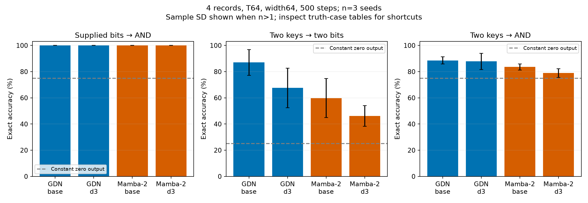

# Retrieval and conjunction at 500 steps

Mean ± sample SD when multiple seeds are available. Accuracy values are percentages. Retrieval exact accuracy requires both bits correct; AND exact accuracy requires its one answer correct. Every test has equal00/01/10/11 counts. Always-zero AND accuracy is75%, so inspect all four cases.

## 4 records, width64, T64

### Supplied bits → AND

| Model | Seeds | Accuracy | Exact | 00 exact | 01 exact | 10 exact | 11 exact | Worst-case exact |
|---|---:|---:|---:|---:|---:|---:|---:|---:|
| GDN | 3 | 100.00 ± 0.00 | 100.00 ± 0.00 | 100.00 ± 0.00 | 100.00 ± 0.00 | 100.00 ± 0.00 | 100.00 ± 0.00 | 100.00 ± 0.00 |
| GDN + SMat d3 | 3 | 100.00 ± 0.00 | 100.00 ± 0.00 | 100.00 ± 0.00 | 100.00 ± 0.00 | 100.00 ± 0.00 | 100.00 ± 0.00 | 100.00 ± 0.00 |
| Mamba-2 | 3 | 100.00 ± 0.00 | 100.00 ± 0.00 | 100.00 ± 0.00 | 100.00 ± 0.00 | 100.00 ± 0.00 | 100.00 ± 0.00 | 100.00 ± 0.00 |
| Mamba-2 + SMat d3 | 3 | 100.00 ± 0.00 | 100.00 ± 0.00 | 100.00 ± 0.00 | 100.00 ± 0.00 | 100.00 ± 0.00 | 100.00 ± 0.00 | 100.00 ± 0.00 |

Query-blind memory-count oracle, per-target accuracy: 81.21 ± 0.54%. This oracle knows the memory bit counts but ignores the queried keys.

### Two keys → two bits

| Model | Seeds | Accuracy | Exact | 00 exact | 01 exact | 10 exact | 11 exact | Worst-case exact |
|---|---:|---:|---:|---:|---:|---:|---:|---:|
| GDN | 3 | 93.27 ± 5.11 | 87.00 ± 9.75 | 90.95 ± 6.05 | 83.33 ± 12.78 | 82.65 ± 14.88 | 91.05 ± 5.40 | 82.16 ± 14.58 |
| GDN + SMat d3 | 3 | 82.21 ± 9.13 | 67.55 ± 15.09 | 84.28 ± 6.13 | 53.39 ± 21.19 | 50.55 ± 32.21 | 82.00 ± 4.78 | 47.46 ± 30.53 |
| Mamba-2 | 3 | 78.18 ± 8.70 | 59.81 ± 14.96 | 84.96 ± 5.49 | 37.86 ± 33.46 | 36.49 ± 32.13 | 79.95 ± 4.92 | 36.20 ± 32.60 |
| Mamba-2 + SMat d3 | 3 | 69.43 ± 5.77 | 46.20 ± 7.88 | 80.63 ± 9.74 | 11.59 ± 11.80 | 10.35 ± 14.67 | 82.23 ± 1.92 | 9.64 ± 13.44 |

Query-blind memory-count oracle, per-target accuracy: 68.89 ± 0.38%. This oracle knows the memory bit counts but ignores the queried keys.

### Two keys → AND

| Model | Seeds | Accuracy | Exact | 00 exact | 01 exact | 10 exact | 11 exact | Worst-case exact |
|---|---:|---:|---:|---:|---:|---:|---:|---:|
| GDN | 3 | 88.53 ± 2.71 | 88.53 ± 2.71 | 99.97 ± 0.06 | 90.98 ± 2.81 | 92.74 ± 1.66 | 70.41 ± 8.44 | 70.41 ± 8.44 |
| GDN + SMat d3 | 3 | 87.81 ± 6.18 | 87.81 ± 6.18 | 99.80 ± 0.20 | 93.00 ± 2.73 | 91.60 ± 5.32 | 66.83 ± 16.64 | 66.83 ± 16.64 |
| Mamba-2 | 3 | 83.54 ± 2.25 | 83.54 ± 2.25 | 100.00 ± 0.00 | 88.80 ± 6.57 | 88.22 ± 7.59 | 57.13 ± 11.65 | 57.13 ± 11.65 |
| Mamba-2 + SMat d3 | 3 | 78.88 ± 3.43 | 78.88 ± 3.43 | 99.87 ± 0.06 | 93.10 ± 6.20 | 93.68 ± 5.85 | 28.87 ± 25.63 | 28.87 ± 25.63 |

Query-blind memory-count oracle, per-target accuracy: 81.21 ± 0.54%. This oracle knows the memory bit counts but ignores the queried keys.

| Model | Seeds | AND composed from retrieved bits | End-to-end AND | End-to-end AND balanced accuracy |
|---|---:|---:|---:|---:|
| GDN | 3 | 94.21 ± 4.42 | 88.53 ± 2.71 | 82.49 ± 4.53 |
| GDN + SMat d3 | 3 | 84.42 ± 7.66 | 87.81 ± 6.18 | 80.82 ± 9.67 |
| Mamba-2 | 3 | 80.52 ± 7.34 | 83.54 ± 2.25 | 74.73 ± 4.27 |
| Mamba-2 + SMat d3 | 3 | 70.85 ± 8.46 | 78.88 ± 3.43 | 62.21 ± 10.82 |

| Model | Paired seeds | AND accuracy gain over backbone (pp) | Total / trainable parameters |
|---|---:|---:|---:|
| GDN | 3 | — | 23,464 / 23,464 |
| GDN + SMat d3 | 3 | -0.72 ± 8.22 | 38,200 / 32,568 |
| Mamba-2 | 3 | — | 58,352 / 58,352 |
| Mamba-2 + SMat d3 | 3 | -4.65 ± 5.53 | 99,904 / 93,760 |

