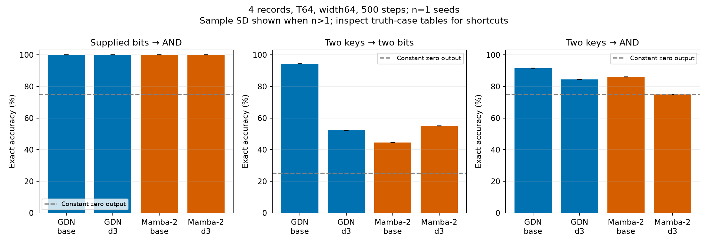

# Retrieval and conjunction at 500 steps

Mean ± sample SD when multiple seeds are available. Accuracy values are percentages. Retrieval exact accuracy requires both bits correct; AND exact accuracy requires its one answer correct. Every test has equal00/01/10/11 counts. Always-zero AND accuracy is75%, so inspect all four cases.

## 4 records, width64, T64

### Supplied bits → AND

| Model | Seeds | Accuracy | Exact | 00 exact | 01 exact | 10 exact | 11 exact | Worst-case exact |
|---|---:|---:|---:|---:|---:|---:|---:|---:|
| GDN | 1 | 100.00 | 100.00 | 100.00 | 100.00 | 100.00 | 100.00 | 100.00 |
| GDN + SMat d3 | 1 | 100.00 | 100.00 | 100.00 | 100.00 | 100.00 | 100.00 | 100.00 |
| Mamba-2 | 1 | 100.00 | 100.00 | 100.00 | 100.00 | 100.00 | 100.00 | 100.00 |
| Mamba-2 + SMat d3 | 1 | 100.00 | 100.00 | 100.00 | 100.00 | 100.00 | 100.00 | 100.00 |

Query-blind memory-count oracle, per-target accuracy: 81.81%. This oracle knows the memory bit counts but ignores the queried keys.

### Two keys → two bits

| Model | Seeds | Accuracy | Exact | 00 exact | 01 exact | 10 exact | 11 exact | Worst-case exact |
|---|---:|---:|---:|---:|---:|---:|---:|---:|
| GDN | 1 | 97.17 | 94.41 | 96.29 | 93.36 | 93.16 | 94.82 | 93.16 |
| GDN + SMat d3 | 1 | 72.63 | 52.15 | 81.45 | 32.13 | 14.36 | 80.66 | 14.36 |
| Mamba-2 | 1 | 69.37 | 44.56 | 89.36 | 1.27 | 2.15 | 85.45 | 1.27 |
| Mamba-2 + SMat d3 | 1 | 75.65 | 55.00 | 83.69 | 25.10 | 27.25 | 83.98 | 25.10 |

Query-blind memory-count oracle, per-target accuracy: 69.02%. This oracle knows the memory bit counts but ignores the queried keys.

### Two keys → AND

| Model | Seeds | Accuracy | Exact | 00 exact | 01 exact | 10 exact | 11 exact | Worst-case exact |
|---|---:|---:|---:|---:|---:|---:|---:|---:|
| GDN | 1 | 91.58 | 91.58 | 100.00 | 93.55 | 94.43 | 78.32 | 78.32 |
| GDN + SMat d3 | 1 | 84.45 | 84.45 | 99.61 | 90.92 | 89.45 | 57.81 | 57.81 |
| Mamba-2 | 1 | 85.99 | 85.99 | 100.00 | 91.31 | 90.04 | 62.60 | 62.60 |
| Mamba-2 + SMat d3 | 1 | 74.95 | 74.95 | 99.90 | 100.00 | 99.90 | 0.00 | 0.00 |

Query-blind memory-count oracle, per-target accuracy: 81.81%. This oracle knows the memory bit counts but ignores the queried keys.

| Model | Seeds | AND composed from retrieved bits | End-to-end AND | End-to-end AND balanced accuracy |
|---|---:|---:|---:|---:|
| GDN | 1 | 97.34 | 91.58 | 87.16 |
| GDN + SMat d3 | 1 | 76.61 | 84.45 | 75.57 |
| Mamba-2 | 1 | 73.05 | 85.99 | 78.19 |
| Mamba-2 + SMat d3 | 1 | 78.61 | 74.95 | 49.97 |

| Model | Paired seeds | AND accuracy gain over backbone (pp) | Total / trainable parameters |
|---|---:|---:|---:|
| GDN | 1 | — | 23,464 / 23,464 |
| GDN + SMat d3 | 1 | -7.13 | 38,200 / 32,568 |
| Mamba-2 | 1 | — | 58,352 / 58,352 |
| Mamba-2 + SMat d3 | 1 | -11.04 | 99,904 / 93,760 |

