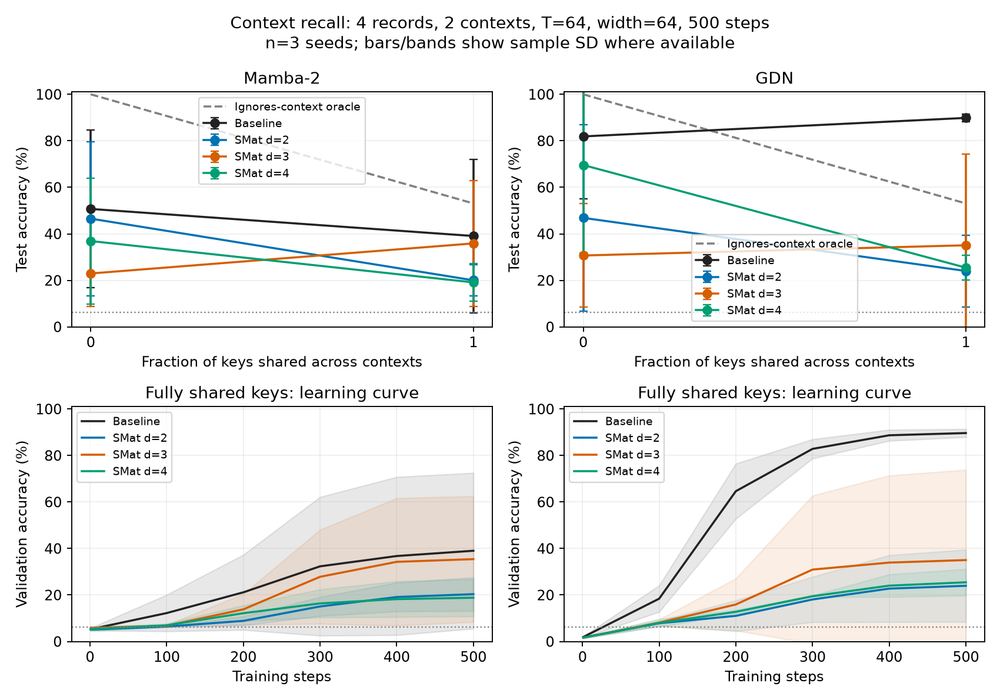

# Context-dependent recall: completed 500-step experiment

**No reliable SMat win in this setup.** Across three paired seeds at four
records, every SMat variant has lower mean shared-key accuracy than its native
backbone. Native GDN learns contextual retrieval consistently. Mamba and several
SMat variants show large seed variation. The initial Mamba+d3 success did not
repeat as a contextual-retrieval result in the two additional seeds.

All 64 runs completed at exactly 500 steps on DeltaAI `ghx4-interactive`:
48 four-record runs (eight models × two conditions × three seeds) and 16
eight-record screening runs (one seed). Seeds are 123, 456, and 789; the screen
uses 123. The full first-seed screen was saved before confirmation. See
[protocol](PROTOCOL.md), [complete tables](report.md), and [raw results](results.csv).

## Fully shared keys, four records

Test accuracy and context gap are mean ± sample SD across three seeds.
The context gap subtracts accuracy against the same key's value in the other
context from accuracy against the correct value. A context-ignorant strategy
has expected gap zero. The values-only uniform chance reference is 6.25%; the
oracle that knows the key's values but ignores context reaches about 53%.
Raw accuracy above chance alone does not establish context binding.

| Model | Accuracy (%) | Context gap (pp) |
|---|---:|---:|
| Mamba-2 | 39.07 ± 33.00 | 20.32 ± 35.31 |
| Mamba-2 + SMat d2 | 20.02 ± 6.64 | 3.47 ± 6.34 |
| Mamba-2 + SMat d3 | 35.89 ± 27.13 | 16.19 ± 27.17 |
| Mamba-2 + SMat d4 | 19.12 ± 8.11 | 0.01 ± 0.01 |
| GDN | 89.87 ± 1.61 | 80.41 ± 1.84 |
| GDN + SMat d2 | 24.03 ± 15.43 | 6.53 ± 10.99 |
| GDN + SMat d3 | 35.08 ± 39.25 | 22.33 ± 38.50 |
| GDN + SMat d4 | 25.45 ± 5.36 | 8.64 ± 8.60 |

GDN SMat uses the existing selected transport implementation; native GDN has
no SMat transport. Native GDN wins against every GDN SMat variant in every
shared-key seed. Its exact accuracy across all four queries is 68.90 ± 3.72%.

## The first-seed Mamba+d3 candidate

| Seed | Mamba (%) | Mamba+d3 (%) | Paired gain (pp) | d3 context gap (pp) |
|---|---:|---:|---:|---:|
| 123 | 26.46 | 67.20 | +40.74 | +47.56 |
| 456 | 14.23 | 19.59 | +5.36 | +0.73 |
| 789 | 76.52 | 20.87 | −55.65 | +0.27 |

The mean paired gain is −3.18 ± 48.76 pp. Seed 123 learned context binding;
the other two d3 seeds have near-zero context gaps. This does not support a
repeatable advantage or a claim that SMat alone can solve the task.

There is a narrower exploratory pattern: d3's relative advantage improves when
keys are shared, compared with the unique-key control, in all three seeds
(+28.68, +25.86, +19.17 pp; mean +24.57 ± 4.88 pp). However, d3 starts from a
large unique-key deficit (−27.75 pp on average), and remains behind on mean
shared-key accuracy. This interaction is hypothesis-generating, not a benchmark
win; d3 was also selected for attention after the first-seed screen.

## Higher load and interpretation

At eight records, all eight models have near-zero context gaps with shared
keys (−0.73 to +0.40 pp, seed 123). This is a failure to learn contextual
retrieval under this training budget, not evidence about a capacity ceiling.
We retained these results and uniformly reduced the load for every model to
establish a learnable setting. We did not extend training or retune models.

The setup uses explicit `(context, key, value)` triples, with records shuffled
into random slots and four `(QUERY, context, key)` queries. It is not an exact
replication of the published block-context joint-recall encoding. Both reuse
conditions hold T=64, record count, context IDs, values, record positions/order,
and query entry indices fixed; only key identities change. There are two
contexts, 16 possible answer values, width 64, and two layers. The original
batch-32 AdamW recipe and model implementations are reused. Answers are never
provided as query inputs. There is no alignment to SMat reset positions.

These are comparisons of existing implementations: SMat adds parameters,
memory, routing loss, and its existing halfway reset. They are not parameter-
matched mechanism ablations. A source-position diagnostic on the initial d1/d4
models found poor d4 performance in both sequence halves; it does not establish
why d4 fails. Three seeds remain a small sample, and matched random seeds/data
do not make the BF16/custom-kernel pipeline bitwise deterministic.

## Verification and artifacts

[The audit](audit.json) passed for all 64 runs: complete expected grid, matched
recipes within each condition/seed, independently decoded targets, regenerated
validation/test hashes, recomputed accuracy/exact/context-gap metrics from saved
predictions, and reuse-condition pairing. Each final test has 4,096 examples
and 16,384 supervised queries. Validation has 1,024 independent examples.

All four training jobs completed successfully: 3171735, 3171748, 3171757,
3171798; [accounting](jobs.txt) records 24m40s total elapsed on one GPU per job.
`source-pilot.tar.gz` and `source-final.tar.gz` preserve source snapshots with
SHA-256 manifests. Model/trainer sources are unchanged between these snapshots;
only the task's validation guards/parser cleanup, collector, and job launcher
changed, plus the final audit script. Run folders preserve checkpoints,
recipes, learning curves, metrics, and test predictions.

