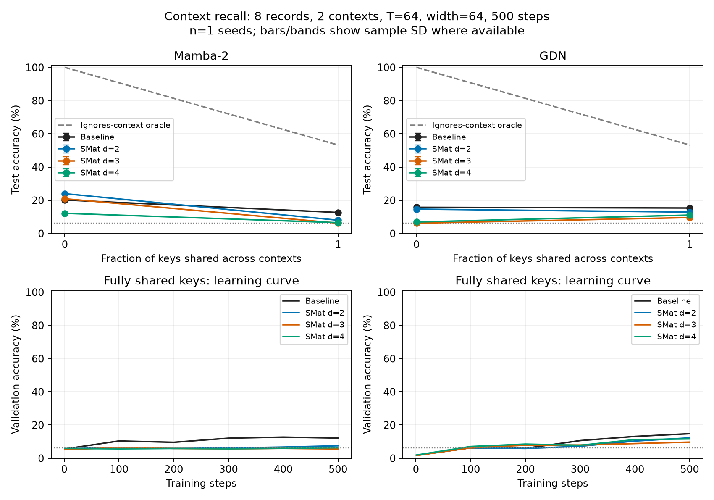

# Context-dependent recall at 500 steps

Explicit-context triples; fixed record count and length within each reuse comparison. Mean ± sample SD when multiple seeds are available. Full-vocabulary predictions, 16 equiprobable answer values (6.25% value chance). Context gap compares a prediction with the queried context versus another context for the same key. It is undefined when keys are unique. No claim of an exact replication of the block-context paper task.

## 4 records, 2 contexts, width 64, length 64

| Model | Shared fraction | Seeds | Accuracy (%) | Exact four-query (%) | Context gap (pp) | Gain vs backbone (pp) | Total / trainable parameters |
|---|---:|---:|---:|---:|---:|---:|---:|
| GDN | 0 | 3 | 81.90 ± 26.82 | 61.34 ± 49.89 | — | — | 28,328 / 28,328 |
| GDN | 1 | 3 | 89.87 ± 1.61 | 68.90 ± 3.72 | 80.41 ± 1.84 | — | 28,328 / 28,328 |
| GDN + SMat d=2 | 0 | 3 | 46.86 ± 40.15 | 22.22 ± 37.05 | — | -35.04 ± 45.34 | 35,284 / 31,188 |
| GDN + SMat d=2 | 1 | 3 | 24.03 ± 15.43 | 0.45 ± 0.67 | 6.53 ± 10.99 | -65.84 ± 15.89 | 35,284 / 31,188 |
| GDN + SMat d=3 | 0 | 3 | 30.68 ± 22.24 | 1.31 ± 2.27 | — | -51.22 ± 26.41 | 43,064 / 37,432 |
| GDN + SMat d=3 | 1 | 3 | 35.08 ± 39.25 | 17.11 ± 29.63 | 22.33 ± 38.50 | -54.78 ± 38.86 | 43,064 / 37,432 |
| GDN + SMat d=4 | 0 | 3 | 69.60 ± 37.84 | 47.99 ± 43.92 | — | -12.30 ± 53.52 | 47,460 / 40,036 |
| GDN + SMat d=4 | 1 | 3 | 25.45 ± 5.36 | 0.08 ± 0.10 | 8.64 ± 8.60 | -64.41 ± 4.64 | 47,460 / 40,036 |
| Mamba-2 | 0 | 3 | 50.71 ± 33.93 | 22.55 ± 38.59 | — | — | 63,216 / 63,216 |
| Mamba-2 | 1 | 3 | 39.07 ± 33.00 | 15.48 ± 26.79 | 20.32 ± 35.31 | — | 63,216 / 63,216 |
| Mamba-2 + SMat d=2 | 0 | 3 | 46.54 ± 33.11 | 13.18 ± 20.27 | — | -4.17 ± 48.18 | 73,648 / 73,648 |
| Mamba-2 + SMat d=2 | 1 | 3 | 20.02 ± 6.64 | 0.01 ± 0.01 | 3.47 ± 6.34 | -19.05 ± 39.62 | 73,648 / 73,648 |
| Mamba-2 + SMat d=3 | 0 | 3 | 22.95 ± 14.27 | 0.18 ± 0.31 | — | -27.75 ± 43.89 | 104,768 / 98,624 |
| Mamba-2 + SMat d=3 | 1 | 3 | 35.89 ± 27.13 | 10.92 ± 18.92 | 16.19 ± 27.17 | -3.18 ± 48.76 | 104,768 / 98,624 |
| Mamba-2 + SMat d=4 | 0 | 3 | 36.89 ± 27.04 | 3.85 ± 4.54 | — | -13.81 ± 60.07 | 122,352 / 109,040 |
| Mamba-2 + SMat d=4 | 1 | 3 | 19.12 ± 8.11 | 0.00 ± 0.00 | 0.01 ± 0.01 | -19.95 ± 31.62 | 122,352 / 109,040 |

| Model | Paired seeds | Gain with unique keys (pp) | Gain with shared keys (pp) | Change in advantage (pp) |
|---|---:|---:|---:|---:|
| Mamba-2 + SMat d=2 | 3 | -4.17 ± 48.18 | -19.05 ± 39.62 | -14.88 ± 44.30 |
| Mamba-2 + SMat d=3 | 3 | -27.75 ± 43.89 | -3.18 ± 48.76 | 24.57 ± 4.88 |
| Mamba-2 + SMat d=4 | 3 | -13.81 ± 60.07 | -19.95 ± 31.62 | -6.13 ± 28.79 |
| GDN + SMat d=2 | 3 | -35.04 ± 45.34 | -65.84 ± 15.89 | -30.80 ± 54.70 |
| GDN + SMat d=3 | 3 | -51.22 ± 26.41 | -54.78 ± 38.86 | -3.56 ± 26.24 |
| GDN + SMat d=4 | 3 | -12.30 ± 53.52 | -64.41 ± 4.64 | -52.11 ± 50.25 |

## 8 records, 2 contexts, width 64, length 64

| Model | Shared fraction | Seeds | Accuracy (%) | Exact four-query (%) | Context gap (pp) | Gain vs backbone (pp) | Total / trainable parameters |
|---|---:|---:|---:|---:|---:|---:|---:|
| GDN | 0 | 1 | 15.75 | 0.00 | — | — | 28,328 / 28,328 |
| GDN | 1 | 1 | 15.33 | 0.05 | -0.73 | — | 28,328 / 28,328 |
| GDN + SMat d=2 | 0 | 1 | 14.67 | 0.00 | — | -1.07 | 35,284 / 31,188 |
| GDN + SMat d=2 | 1 | 1 | 12.85 | 0.00 | -0.31 | -2.47 | 35,284 / 31,188 |
| GDN + SMat d=3 | 0 | 1 | 6.18 | 0.00 | — | -9.56 | 43,064 / 37,432 |
| GDN + SMat d=3 | 1 | 1 | 9.56 | 0.00 | -0.19 | -5.76 | 43,064 / 37,432 |
| GDN + SMat d=4 | 0 | 1 | 6.90 | 0.00 | — | -8.85 | 47,460 / 40,036 |
| GDN + SMat d=4 | 1 | 1 | 11.07 | 0.00 | -0.08 | -4.25 | 47,460 / 40,036 |
| Mamba-2 | 0 | 1 | 20.14 | 0.02 | — | — | 63,216 / 63,216 |
| Mamba-2 | 1 | 1 | 12.65 | 0.00 | 0.40 | — | 63,216 / 63,216 |
| Mamba-2 + SMat d=2 | 0 | 1 | 23.97 | 0.10 | — | 3.83 | 73,648 / 73,648 |
| Mamba-2 + SMat d=2 | 1 | 1 | 7.98 | 0.00 | 0.17 | -4.66 | 73,648 / 73,648 |
| Mamba-2 + SMat d=3 | 0 | 1 | 20.91 | 0.17 | — | 0.77 | 104,768 / 98,624 |
| Mamba-2 + SMat d=3 | 1 | 1 | 6.21 | 0.00 | -0.15 | -6.44 | 104,768 / 98,624 |
| Mamba-2 + SMat d=4 | 0 | 1 | 12.15 | 0.00 | — | -8.00 | 122,352 / 109,040 |
| Mamba-2 + SMat d=4 | 1 | 1 | 6.51 | 0.02 | 0.18 | -6.13 | 122,352 / 109,040 |

| Model | Paired seeds | Gain with unique keys (pp) | Gain with shared keys (pp) | Change in advantage (pp) |
|---|---:|---:|---:|---:|
| Mamba-2 + SMat d=2 | 1 | 3.83 | -4.66 | -8.50 |
| Mamba-2 + SMat d=3 | 1 | 0.77 | -6.44 | -7.21 |
| Mamba-2 + SMat d=4 | 1 | -8.00 | -6.13 | 1.86 |
| GDN + SMat d=2 | 1 | -1.07 | -2.47 | -1.40 |
| GDN + SMat d=3 | 1 | -9.56 | -5.76 | 3.80 |
| GDN + SMat d=4 | 1 | -8.85 | -4.25 | 4.60 |

