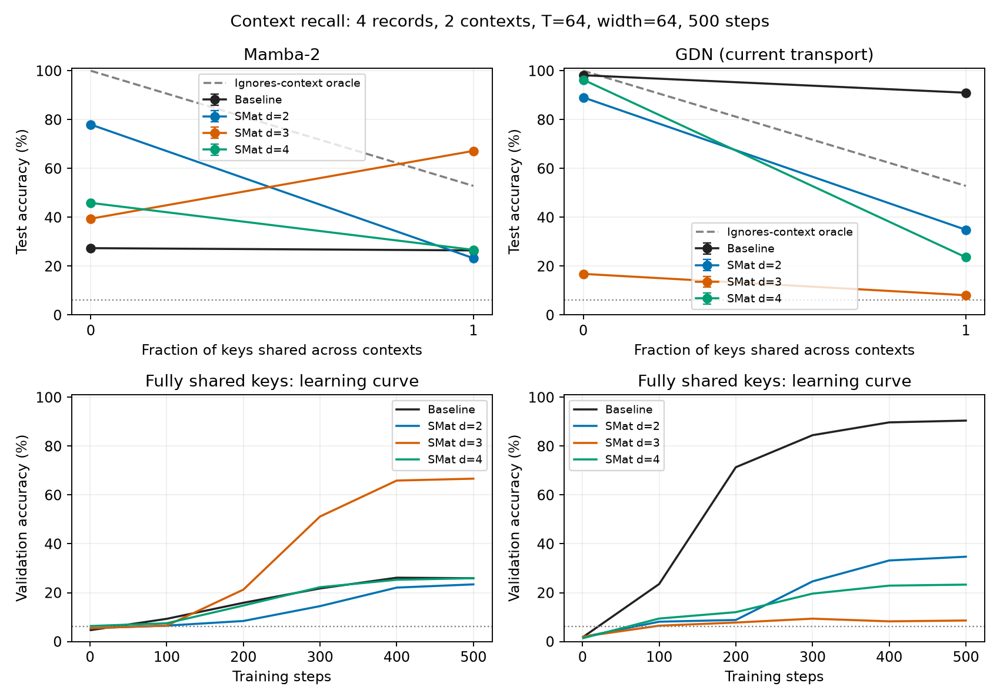
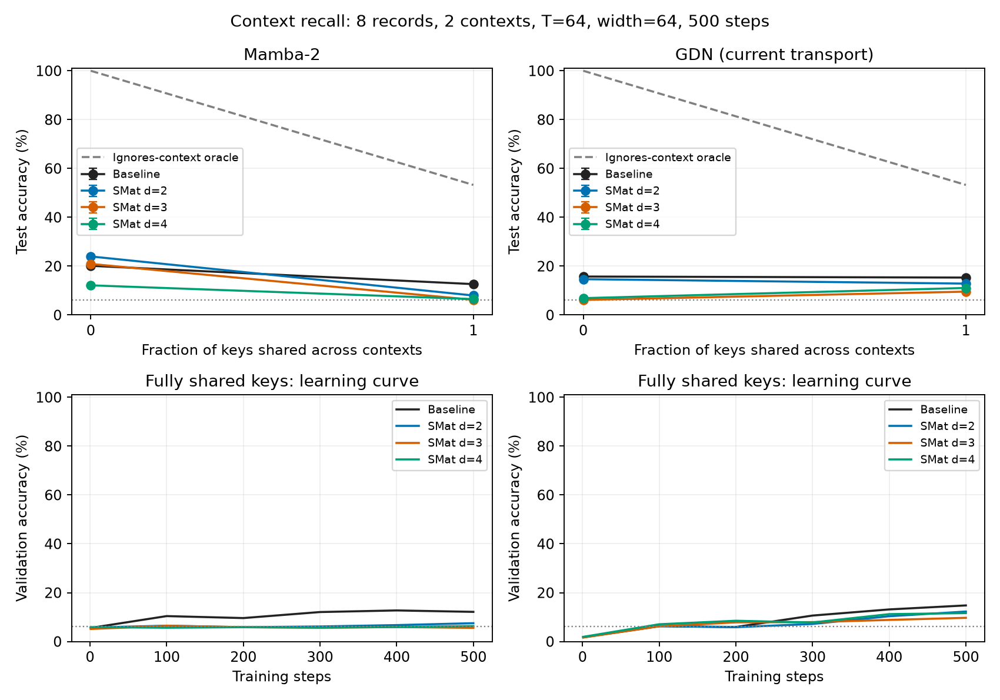

# Context-dependent recall at 500 steps

Explicit-context triples; fixed record count and length within each reuse comparison. Mean ± sample SD when multiple seeds are available. Full-vocabulary predictions, 16 equiprobable answer values (6.25% value chance). Context gap compares a prediction with the queried context versus another context for the same key. It is undefined when keys are unique. No claim of an exact replication of the block-context paper task.

## 4 records, 2 contexts, width 64, length 64

| Model | Shared fraction | Seeds | Accuracy (%) | Exact four-query (%) | Context gap (pp) | Gain vs backbone (pp) | Total / trainable parameters |
|---|---:|---:|---:|---:|---:|---:|---:|
| GDN (current transport) | 0 | 1 | 98.18 | 93.04 | — | — | 28,328 / 28,328 |
| GDN (current transport) | 1 | 1 | 91.02 | 72.14 | 81.21 | — | 28,328 / 28,328 |
| GDN (current transport) + SMat d=2 | 0 | 1 | 89.10 | 64.99 | — | -9.08 | 35,284 / 31,188 |
| GDN (current transport) + SMat d=2 | 1 | 1 | 34.89 | 1.22 | 19.22 | -56.13 | 35,284 / 31,188 |
| GDN (current transport) + SMat d=3 | 0 | 1 | 16.83 | 0.00 | — | -81.35 | 43,064 / 37,432 |
| GDN (current transport) + SMat d=3 | 1 | 1 | 8.09 | 0.00 | 0.17 | -82.93 | 43,064 / 37,432 |
| GDN (current transport) + SMat d=4 | 0 | 1 | 96.34 | 86.77 | — | -1.84 | 47,460 / 40,036 |
| GDN (current transport) + SMat d=4 | 1 | 1 | 23.63 | 0.05 | 8.23 | -67.39 | 47,460 / 40,036 |
| Mamba-2 | 0 | 1 | 27.37 | 0.02 | — | — | 63,216 / 63,216 |
| Mamba-2 | 1 | 1 | 26.46 | 0.02 | -0.12 | — | 63,216 / 63,216 |
| Mamba-2 + SMat d=2 | 0 | 1 | 77.98 | 36.52 | — | 50.61 | 73,648 / 73,648 |
| Mamba-2 + SMat d=2 | 1 | 1 | 23.27 | 0.00 | -0.19 | -3.19 | 73,648 / 73,648 |
| Mamba-2 + SMat d=3 | 0 | 1 | 39.43 | 0.54 | — | 12.06 | 104,768 / 98,624 |
| Mamba-2 + SMat d=3 | 1 | 1 | 67.20 | 32.76 | 47.56 | 40.74 | 104,768 / 98,624 |
| Mamba-2 + SMat d=4 | 0 | 1 | 45.90 | 2.69 | — | 18.52 | 122,352 / 109,040 |
| Mamba-2 + SMat d=4 | 1 | 1 | 26.68 | 0.00 | 0.00 | 0.22 | 122,352 / 109,040 |

## 8 records, 2 contexts, width 64, length 64

| Model | Shared fraction | Seeds | Accuracy (%) | Exact four-query (%) | Context gap (pp) | Gain vs backbone (pp) | Total / trainable parameters |
|---|---:|---:|---:|---:|---:|---:|---:|
| GDN (current transport) | 0 | 1 | 15.75 | 0.00 | — | — | 28,328 / 28,328 |
| GDN (current transport) | 1 | 1 | 15.33 | 0.05 | -0.73 | — | 28,328 / 28,328 |
| GDN (current transport) + SMat d=2 | 0 | 1 | 14.67 | 0.00 | — | -1.07 | 35,284 / 31,188 |
| GDN (current transport) + SMat d=2 | 1 | 1 | 12.85 | 0.00 | -0.31 | -2.47 | 35,284 / 31,188 |
| GDN (current transport) + SMat d=3 | 0 | 1 | 6.18 | 0.00 | — | -9.56 | 43,064 / 37,432 |
| GDN (current transport) + SMat d=3 | 1 | 1 | 9.56 | 0.00 | -0.19 | -5.76 | 43,064 / 37,432 |
| GDN (current transport) + SMat d=4 | 0 | 1 | 6.90 | 0.00 | — | -8.85 | 47,460 / 40,036 |
| GDN (current transport) + SMat d=4 | 1 | 1 | 11.07 | 0.00 | -0.08 | -4.25 | 47,460 / 40,036 |
| Mamba-2 | 0 | 1 | 20.14 | 0.02 | — | — | 63,216 / 63,216 |
| Mamba-2 | 1 | 1 | 12.65 | 0.00 | 0.40 | — | 63,216 / 63,216 |
| Mamba-2 + SMat d=2 | 0 | 1 | 23.97 | 0.10 | — | 3.83 | 73,648 / 73,648 |
| Mamba-2 + SMat d=2 | 1 | 1 | 7.98 | 0.00 | 0.17 | -4.66 | 73,648 / 73,648 |
| Mamba-2 + SMat d=3 | 0 | 1 | 20.91 | 0.17 | — | 0.77 | 104,768 / 98,624 |
| Mamba-2 + SMat d=3 | 1 | 1 | 6.21 | 0.00 | -0.15 | -6.44 | 104,768 / 98,624 |
| Mamba-2 + SMat d=4 | 0 | 1 | 12.15 | 0.00 | — | -8.00 | 122,352 / 109,040 |
| Mamba-2 + SMat d=4 | 1 | 1 | 6.51 | 0.02 | 0.18 | -6.13 | 122,352 / 109,040 |

