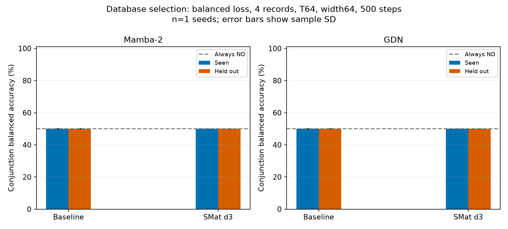

# Database selection at 500 steps

Mean ± sample SD across seeds; all accuracy values in percent. Held-out queries use unseen combinations of known attribute values. Balanced accuracy gives equal weight to YES and NO recall. Always-NO balanced accuracy is 50%; raw conjunction accuracy is about 93.75%.

## balanced loss, 4 records, width64, T64

### Seen combinations

| Model | Seeds | Single BA | Conjunction BA | Conjunction exact set | Nonempty conjunction exact | Conjunction F1 | Paired conjunction BA gain (pp) |
|---|---:|---:|---:|---:|---:|---:|---:|
| GDN | 1 | 50.30 | 50.00 | 0.00 | 0.00 | 11.65 | — |
| GDN + SMat d3 | 1 | 50.00 | 50.00 | 0.00 | 0.00 | 11.66 | 0.00 |
| Mamba-2 | 1 | 50.00 | 50.00 | 0.00 | 0.00 | 11.66 | — |
| Mamba-2 + SMat d3 | 1 | 50.00 | 50.00 | 0.00 | 0.00 | 11.66 | 0.00 |

Always-NO conjunction exact-set baseline: 77.27%.

### Held-out combinations

| Model | Seeds | Single BA | Conjunction BA | Conjunction exact set | Nonempty conjunction exact | Conjunction F1 | Paired conjunction BA gain (pp) |
|---|---:|---:|---:|---:|---:|---:|---:|
| GDN | 1 | 50.12 | 50.01 | 0.00 | 0.00 | 11.88 | — |
| GDN + SMat d3 | 1 | 50.00 | 50.00 | 0.00 | 0.00 | 11.88 | -0.01 |
| Mamba-2 | 1 | 50.00 | 50.00 | 0.00 | 0.00 | 11.88 | — |
| Mamba-2 + SMat d3 | 1 | 50.00 | 50.00 | 0.00 | 0.00 | 11.88 | 0.00 |

Always-NO conjunction exact-set baseline: 77.20%.

| Model | Total / trainable parameters |
|---|---:|
| GDN | 24,168 / 24,168 |
| GDN + SMat d3 | 38,904 / 33,272 |
| Mamba-2 | 59,056 / 59,056 |
| Mamba-2 + SMat d3 | 100,608 / 94,464 |

## unweighted loss, 4 records, width64, T64

### Seen combinations

| Model | Seeds | Single BA | Conjunction BA | Conjunction exact set | Nonempty conjunction exact | Conjunction F1 | Paired conjunction BA gain (pp) |
|---|---:|---:|---:|---:|---:|---:|---:|
| GDN | 1 | 52.93 | 50.17 | 77.22 | 0.00 | 0.78 | — |
| GDN + SMat d3 | 1 | 50.00 | 50.00 | 77.27 | 0.00 | 0.00 | -0.17 |
| Mamba-2 | 1 | 50.00 | 50.00 | 77.27 | 0.00 | 0.00 | — |
| Mamba-2 + SMat d3 | 1 | 50.00 | 50.00 | 77.27 | 0.00 | 0.00 | 0.00 |

Always-NO conjunction exact-set baseline: 77.27%.

### Held-out combinations

| Model | Seeds | Single BA | Conjunction BA | Conjunction exact set | Nonempty conjunction exact | Conjunction F1 | Paired conjunction BA gain (pp) |
|---|---:|---:|---:|---:|---:|---:|---:|
| GDN | 1 | 53.07 | 50.23 | 76.93 | 0.00 | 1.30 | — |
| GDN + SMat d3 | 1 | 50.00 | 50.00 | 77.20 | 0.00 | 0.00 | -0.23 |
| Mamba-2 | 1 | 50.00 | 50.00 | 77.20 | 0.00 | 0.00 | — |
| Mamba-2 + SMat d3 | 1 | 50.00 | 50.00 | 77.20 | 0.00 | 0.00 | 0.00 |

Always-NO conjunction exact-set baseline: 77.20%.

| Model | Total / trainable parameters |
|---|---:|
| GDN | 24,168 / 24,168 |
| GDN + SMat d3 | 38,904 / 33,272 |
| Mamba-2 | 59,056 / 59,056 |
| Mamba-2 + SMat d3 | 100,608 / 94,464 |

