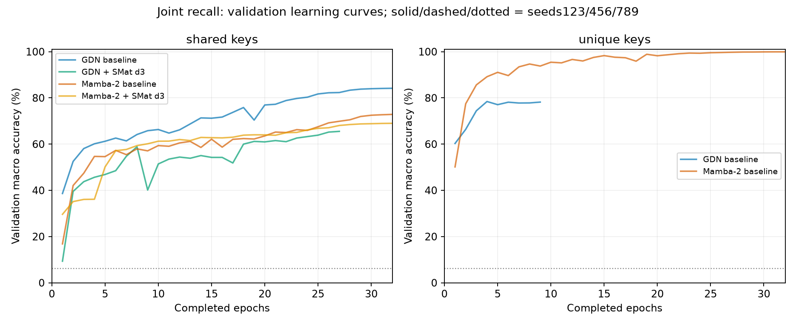
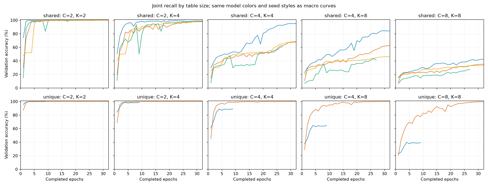

# Block-context joint recall: full epoch budget

Completed 4 of 8 planned runs. Each run:180k fixed training examples, batch256,32 epochs,22,624 updates. Incomplete runs are progress only, not final results. Mean ± sample SD across available seeds. Macro scores weight the five table sizes equally.

| Run | Complete | Epoch | Updates | Latest validation accuracy (%) |
|---|---|---:|---:|---:|
| shared-gdn_current-d1-w64-s123 | True | 32 | 22624 | 84.16 |
| shared-gdn_current-d3-w64-s123 | False | 27 | 19300 | 65.51 |
| shared-mamba2-d1-w64-s123 | True | 32 | 22624 | 72.86 |
| shared-mamba2-d3-w64-s123 | True | 32 | 22624 | 68.99 |
| unique-gdn_current-d1-w64-s123 | False | 9 | 6600 | 78.18 |
| unique-mamba2-d1-w64-s123 | True | 32 | 22624 | 99.92 |

## Analytical lookup controls

These controls read the correct information table but discard context or key identity. They are evaluated on all test queries without fitting any parameters. Uniform guessing among value tokens scores 6.25%; context-blind lookup can score much higher.

| Condition | Table | Key-only majority (%) | Last value for key (%) | Context-only majority (%) |
|---|---|---:|---:|---:|
| shared | c2-k2 | 53.17 | 53.17 | 52.84 |
| shared | c2-k4 | 53.24 | 53.24 | 33.83 |
| shared | c4-k4 | 33.71 | 29.75 | 33.82 |
| shared | c4-k8 | 33.80 | 29.83 | 25.78 |
| shared | c8-k8 | 25.79 | 17.93 | 25.75 |
| unique | c2-k2 | 100.00 | 100.00 | 52.84 |
| unique | c2-k4 | 100.00 | 100.00 | 33.83 |
| unique | c4-k4 | 100.00 | 100.00 | 33.82 |
| unique | c4-k8 | 100.00 | 100.00 | 25.78 |
| unique | c8-k8 | 100.00 | 100.00 | 25.75 |

## final_test

| Condition | Model | Table | Seeds | Accuracy (%) | All-query exact (%) |
|---|---|---|---:|---:|---:|
| shared | GDN | c2-k2 | 1 | 100.00 | 100.00 |
| shared | GDN | c2-k4 | 1 | 98.63 | 90.15 |
| shared | GDN | c4-k4 | 1 | 95.48 | 52.80 |
| shared | GDN | c4-k8 | 1 | 84.15 | 0.55 |
| shared | GDN | c8-k8 | 1 | 42.68 | 0.00 |
| shared | GDN | macro | 1 | 84.19 | 48.70 |
| shared | Mamba-2 | c2-k2 | 1 | 99.98 | 99.90 |
| shared | Mamba-2 | c2-k4 | 1 | 98.22 | 86.95 |
| shared | Mamba-2 | c4-k4 | 1 | 68.83 | 0.00 |
| shared | Mamba-2 | c4-k8 | 1 | 62.38 | 0.00 |
| shared | Mamba-2 | c8-k8 | 1 | 35.06 | 0.00 |
| shared | Mamba-2 | macro | 1 | 72.89 | 37.37 |
| shared | Mamba-2 + SMat d3 | c2-k2 | 1 | 99.99 | 99.95 |
| shared | Mamba-2 + SMat d3 | c2-k4 | 1 | 97.82 | 86.25 |
| shared | Mamba-2 + SMat d3 | c4-k4 | 1 | 67.46 | 0.15 |
| shared | Mamba-2 + SMat d3 | c4-k8 | 1 | 46.52 | 0.00 |
| shared | Mamba-2 + SMat d3 | c8-k8 | 1 | 33.27 | 0.00 |
| shared | Mamba-2 + SMat d3 | macro | 1 | 69.01 | 37.27 |
| unique | Mamba-2 | c2-k2 | 1 | 100.00 | 100.00 |
| unique | Mamba-2 | c2-k4 | 1 | 100.00 | 100.00 |
| unique | Mamba-2 | c4-k4 | 1 | 100.00 | 100.00 |
| unique | Mamba-2 | c4-k8 | 1 | 99.99 | 99.55 |
| unique | Mamba-2 | c8-k8 | 1 | 99.62 | 78.60 |
| unique | Mamba-2 | macro | 1 | 99.92 | 95.63 |

## best_test

| Condition | Model | Table | Seeds | Accuracy (%) | All-query exact (%) |
|---|---|---|---:|---:|---:|
| shared | GDN | c2-k2 | 1 | 100.00 | 100.00 |
| shared | GDN | c2-k4 | 1 | 98.63 | 90.15 |
| shared | GDN | c4-k4 | 1 | 95.48 | 52.80 |
| shared | GDN | c4-k8 | 1 | 84.15 | 0.55 |
| shared | GDN | c8-k8 | 1 | 42.68 | 0.00 |
| shared | GDN | macro | 1 | 84.19 | 48.70 |
| shared | Mamba-2 | c2-k2 | 1 | 99.98 | 99.90 |
| shared | Mamba-2 | c2-k4 | 1 | 98.22 | 86.95 |
| shared | Mamba-2 | c4-k4 | 1 | 68.83 | 0.00 |
| shared | Mamba-2 | c4-k8 | 1 | 62.38 | 0.00 |
| shared | Mamba-2 | c8-k8 | 1 | 35.06 | 0.00 |
| shared | Mamba-2 | macro | 1 | 72.89 | 37.37 |
| shared | Mamba-2 + SMat d3 | c2-k2 | 1 | 99.99 | 99.95 |
| shared | Mamba-2 + SMat d3 | c2-k4 | 1 | 97.82 | 86.25 |
| shared | Mamba-2 + SMat d3 | c4-k4 | 1 | 67.46 | 0.15 |
| shared | Mamba-2 + SMat d3 | c4-k8 | 1 | 46.52 | 0.00 |
| shared | Mamba-2 + SMat d3 | c8-k8 | 1 | 33.27 | 0.00 |
| shared | Mamba-2 + SMat d3 | macro | 1 | 69.01 | 37.27 |
| unique | Mamba-2 | c2-k2 | 1 | 100.00 | 100.00 |
| unique | Mamba-2 | c2-k4 | 1 | 100.00 | 100.00 |
| unique | Mamba-2 | c4-k4 | 1 | 100.00 | 100.00 |
| unique | Mamba-2 | c4-k8 | 1 | 99.99 | 99.55 |
| unique | Mamba-2 | c8-k8 | 1 | 99.62 | 78.60 |
| unique | Mamba-2 | macro | 1 | 99.92 | 95.63 |

