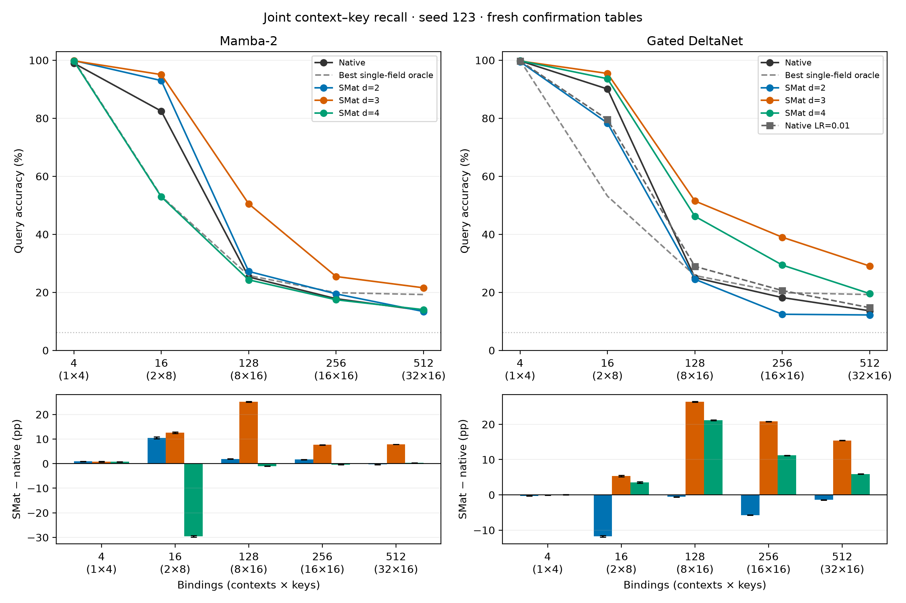

# Fresh-table joint-recall confirmation

Independent split code 9001; 10,000 tables per cell. All final checkpoints were locked before evaluating these tables. All models trained on the same 180,000-example dataset for 32 epochs with seed 123. The primary dimension sweep uses LR0.003; native GDN LR0.01 is an additional control.

Intervals are 95% paired table-bootstrap intervals, conditional on this training seed. They do not quantify variation across training seeds. The prespecified primary positive-result criterion concerns d=3 in both backbones; the other dimensions are reported in full, with no selection based on fresh-table performance.

| Backbone | d | Cell | Native (%) | SMat (%) | Difference (pp), 95% CI | Single-field oracle (%) |
|---|---:|---|---:|---:|---|---:|
| Mamba-2 | 2 | c1-k4 | 98.98 | 99.89 | +0.91 [+0.80, +1.01] | 100.00 |
| Mamba-2 | 2 | c2-k8 | 82.47 | 92.98 | +10.51 [+10.17, +10.86] | 53.16 |
| Mamba-2 | 2 | c8-k16 | 25.29 | 27.21 | +1.92 [+1.83, +2.01] | 25.78 |
| Mamba-2 | 2 | c16-k16 | 17.81 | 19.47 | +1.66 [+1.60, +1.71] | 19.89 |
| Mamba-2 | 2 | c32-k16 | 13.72 | 13.39 | -0.33 [-0.37, -0.30] | 19.24 |
| Mamba-2 | 3 | c1-k4 | 98.98 | 99.79 | +0.81 [+0.71, +0.93] | 100.00 |
| Mamba-2 | 3 | c2-k8 | 82.47 | 95.05 | +12.58 [+12.22, +12.94] | 53.16 |
| Mamba-2 | 3 | c8-k16 | 25.29 | 50.50 | +25.21 [+25.06, +25.36] | 25.78 |
| Mamba-2 | 3 | c16-k16 | 17.81 | 25.45 | +7.64 [+7.55, +7.73] | 19.89 |
| Mamba-2 | 3 | c32-k16 | 13.72 | 21.56 | +7.84 [+7.81, +7.88] | 19.24 |
| Mamba-2 | 4 | c1-k4 | 98.98 | 99.71 | +0.73 [+0.61, +0.85] | 100.00 |
| Mamba-2 | 4 | c2-k8 | 82.47 | 52.94 | -29.53 [-29.88, -29.17] | 53.16 |
| Mamba-2 | 4 | c8-k16 | 25.29 | 24.31 | -0.98 [-1.06, -0.90] | 25.78 |
| Mamba-2 | 4 | c16-k16 | 17.81 | 17.43 | -0.37 [-0.42, -0.33] | 19.89 |
| Mamba-2 | 4 | c32-k16 | 13.72 | 14.04 | +0.32 [+0.29, +0.34] | 19.24 |
| Gated DeltaNet | 2 | c1-k4 | 99.78 | 99.51 | -0.27 [-0.35, -0.19] | 100.00 |
| Gated DeltaNet | 2 | c2-k8 | 90.08 | 78.34 | -11.74 [-11.97, -11.52] | 53.16 |
| Gated DeltaNet | 2 | c8-k16 | 25.07 | 24.50 | -0.56 [-0.64, -0.48] | 25.78 |
| Gated DeltaNet | 2 | c16-k16 | 18.19 | 12.45 | -5.75 [-5.81, -5.69] | 19.89 |
| Gated DeltaNet | 2 | c32-k16 | 13.63 | 12.20 | -1.43 [-1.46, -1.40] | 19.24 |
| Gated DeltaNet | 3 | c1-k4 | 99.78 | 99.73 | -0.05 [-0.11, +0.02] | 100.00 |
| Gated DeltaNet | 3 | c2-k8 | 90.08 | 95.44 | +5.36 [+5.18, +5.55] | 53.16 |
| Gated DeltaNet | 3 | c8-k16 | 25.07 | 51.48 | +26.42 [+26.31, +26.53] | 25.78 |
| Gated DeltaNet | 3 | c16-k16 | 18.19 | 38.99 | +20.79 [+20.71, +20.88] | 19.89 |
| Gated DeltaNet | 3 | c32-k16 | 13.63 | 29.05 | +15.42 [+15.35, +15.48] | 19.24 |
| Gated DeltaNet | 4 | c1-k4 | 99.78 | 99.81 | +0.03 [-0.03, +0.10] | 100.00 |
| Gated DeltaNet | 4 | c2-k8 | 90.08 | 93.62 | +3.55 [+3.36, +3.74] | 53.16 |
| Gated DeltaNet | 4 | c8-k16 | 25.07 | 46.20 | +21.13 [+21.02, +21.24] | 25.78 |
| Gated DeltaNet | 4 | c16-k16 | 18.19 | 29.39 | +11.20 [+11.13, +11.26] | 19.89 |
| Gated DeltaNet | 4 | c32-k16 | 13.63 | 19.55 | +5.91 [+5.87, +5.95] | 19.24 |

## Equal-cell macro accuracy

| Backbone | d | Native (%) | SMat (%) | Difference (pp), 95% CI |
|---|---:|---:|---:|---|
| Mamba-2 | 2 | 47.65 | 50.59 | +2.93 [+2.86, +3.01] |
| Mamba-2 | 3 | 47.65 | 58.47 | +10.82 [+10.73, +10.90] |
| Mamba-2 | 4 | 47.65 | 41.69 | -5.97 [-6.04, -5.89] |
| Gated DeltaNet | 2 | 49.35 | 45.40 | -3.95 [-4.00, -3.90] |
| Gated DeltaNet | 3 | 49.35 | 62.94 | +13.59 [+13.54, +13.64] |
| Gated DeltaNet | 4 | 49.35 | 57.71 | +8.36 [+8.31, +8.41] |

## Additional native controls

A native setting can be strongest at high load while another is strongest in macro accuracy. Both are included when this happens; no high-load advantage is claimed against only the weaker control.

| Native setting | SMat d | Cell | Native (%) | SMat (%) | Difference (pp), 95% CI |
|---|---:|---|---:|---:|---|
| gdn_current-d1-lr01 | 2 | c1-k4 | 99.77 | 99.51 | -0.26 [-0.34, -0.17] |
| gdn_current-d1-lr01 | 2 | c2-k8 | 79.56 | 78.34 | -1.22 [-1.46, -0.97] |
| gdn_current-d1-lr01 | 2 | c8-k16 | 28.94 | 24.50 | -4.44 [-4.52, -4.36] |
| gdn_current-d1-lr01 | 2 | c16-k16 | 20.61 | 12.45 | -8.16 [-8.23, -8.10] |
| gdn_current-d1-lr01 | 2 | c32-k16 | 14.70 | 12.20 | -2.50 [-2.53, -2.46] |
| gdn_current-d1-lr01 | 3 | c1-k4 | 99.77 | 99.73 | -0.03 [-0.10, +0.03] |
| gdn_current-d1-lr01 | 3 | c2-k8 | 79.56 | 95.44 | +15.88 [+15.66, +16.11] |
| gdn_current-d1-lr01 | 3 | c8-k16 | 28.94 | 51.48 | +22.54 [+22.43, +22.65] |
| gdn_current-d1-lr01 | 3 | c16-k16 | 20.61 | 38.99 | +18.37 [+18.29, +18.46] |
| gdn_current-d1-lr01 | 3 | c32-k16 | 14.70 | 29.05 | +14.35 [+14.28, +14.41] |
| gdn_current-d1-lr01 | 4 | c1-k4 | 99.77 | 99.81 | +0.05 [-0.02, +0.11] |
| gdn_current-d1-lr01 | 4 | c2-k8 | 79.56 | 93.62 | +14.07 [+13.83, +14.31] |
| gdn_current-d1-lr01 | 4 | c8-k16 | 28.94 | 46.20 | +17.25 [+17.13, +17.37] |
| gdn_current-d1-lr01 | 4 | c16-k16 | 20.61 | 29.39 | +8.78 [+8.72, +8.84] |
| gdn_current-d1-lr01 | 4 | c32-k16 | 14.70 | 19.55 | +4.84 [+4.80, +4.89] |
| gdn_current-d1-lr01 | 2 | macro | 48.72 | 45.40 | -3.32 [-3.37, -3.26] |
| gdn_current-d1-lr01 | 3 | macro | 48.72 | 62.94 | +14.22 [+14.17, +14.28] |
| gdn_current-d1-lr01 | 4 | macro | 48.72 | 57.71 | +9.00 [+8.94, +9.05] |

## Selected training settings

| Model | Development trial | LR | Weight decay | Parameters | Trainable parameters | GDN extra-memory scalar decay |
|---|---|---:|---:|---:|---:|---|
| Mamba-2 native | explicit_context_capacity512 | 0.003 | 0.1 | 92,976 | 92,976 | N/A |
| Mamba-2 + SMat d=2 | explicit_context_capacity512 | 0.003 | 0.1 | 215,792 | 215,792 | N/A |
| Mamba-2 + SMat d=3 | explicit_context_capacity512 | 0.003 | 0.1 | 683,072 | 631,872 | N/A |
| Mamba-2 + SMat d=4 | explicit_context_capacity512 | 0.003 | 0.1 | 1,358,256 | 1,183,152 | N/A |
| Gated DeltaNet native | explicit_context_capacity512 | 0.003 | 0.1 | 58,088 | 58,088 | N/A |
| Gated DeltaNet + SMat d=2 | explicit_context_capacity512 | 0.003 | 0.1 | 93,140 | 89,044 | True |
| Gated DeltaNet + SMat d=3 | explicit_context_capacity512 | 0.003 | 0.1 | 209,960 | 193,064 | True |
| Gated DeltaNet + SMat d=4 | explicit_context_capacity512 | 0.003 | 0.1 | 378,756 | 330,884 | True |
| Gated DeltaNet native | explicit_context_capacity512_lr01 | 0.01 | 0.1 | 58,088 | 58,088 | N/A |

Backbone width and depth are matched. Total parameter counts are not matched; these results do not isolate the benefit of the mask from the additional parameters.

## Exact-table accuracy

| Model | Macro (%) | 4 bindings (%) | 16 (%) | 128 (%) | 256 (%) | 512 (%) |
|---|---:|---:|---:|---:|---:|---:|
| mamba2-d1 | 22.95 | 96.28 | 18.45 | 0.00 | 0.00 | 0.00 |
| mamba2-d2 | 28.26 | 99.54 | 41.77 | 0.00 | 0.00 | 0.00 |
| mamba2-d3 | 30.86 | 99.19 | 55.12 | 0.00 | 0.00 | 0.00 |
| mamba2-d4 | 19.77 | 98.85 | 0.00 | 0.00 | 0.00 | 0.00 |
| gdn_current-d1 | 25.09 | 99.13 | 26.32 | 0.00 | 0.00 | 0.00 |
| gdn_current-d2 | 20.08 | 98.14 | 2.26 | 0.00 | 0.00 | 0.00 |
| gdn_current-d3 | 30.00 | 98.94 | 51.04 | 0.00 | 0.00 | 0.00 |
| gdn_current-d4 | 27.83 | 99.26 | 39.88 | 0.00 | 0.00 | 0.00 |
| gdn_current-d1-lr01 | 20.73 | 99.07 | 4.60 | 0.00 | 0.00 | 0.00 |

## Single-field controls

| Cell | Key-only majority (%) | Context-only majority (%) | Better rule per table (%) |
|---|---:|---:|---:|
| c1-k4 | 100.00 | 33.55 | 100.00 |
| c2-k8 | 53.16 | 25.78 | 53.16 |
| c8-k16 | 25.78 | 19.25 | 25.78 |
| c16-k16 | 19.25 | 19.23 | 19.89 |
| c32-k16 | 15.09 | 19.24 | 19.24 |

The complete development history, including failed trials, is retained in the parent report. These splits sample fresh tables from the same identifier distribution; this is not a held-out-combination claim.

The single-field control chooses, for each table, the better of the key-only and context-only majority predictors. Both know all stored values but ignore one identifier. The saved result and oracle arrays retain the two controls separately.

