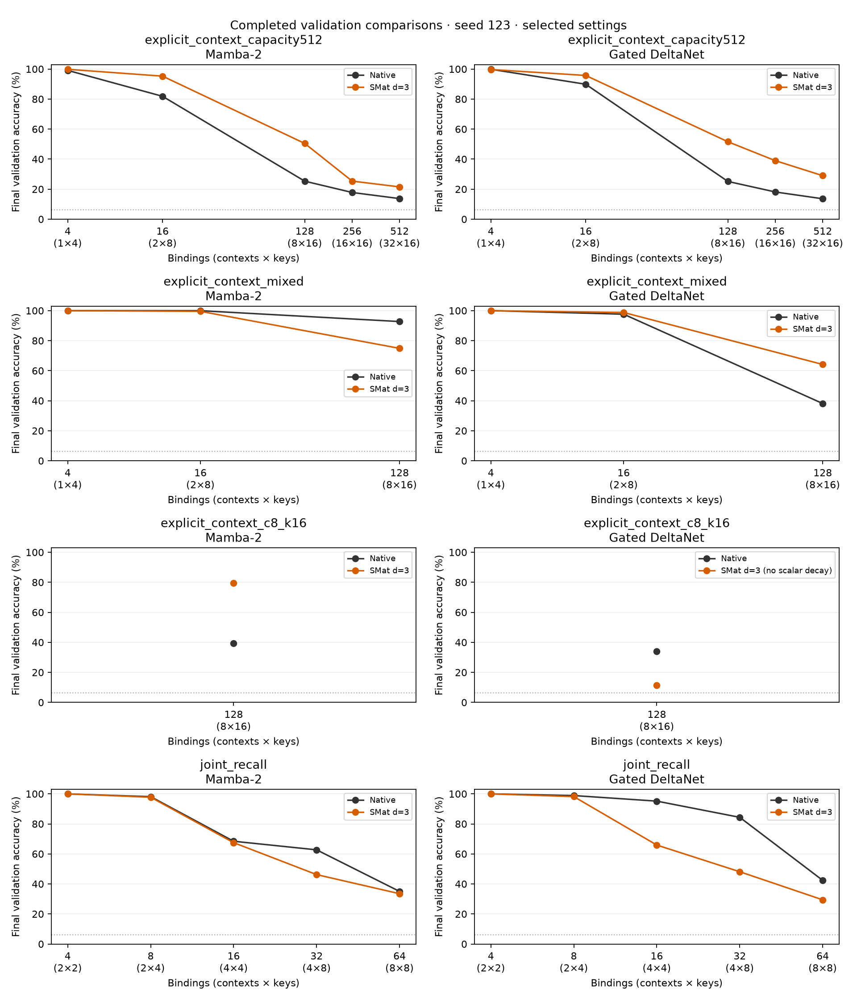
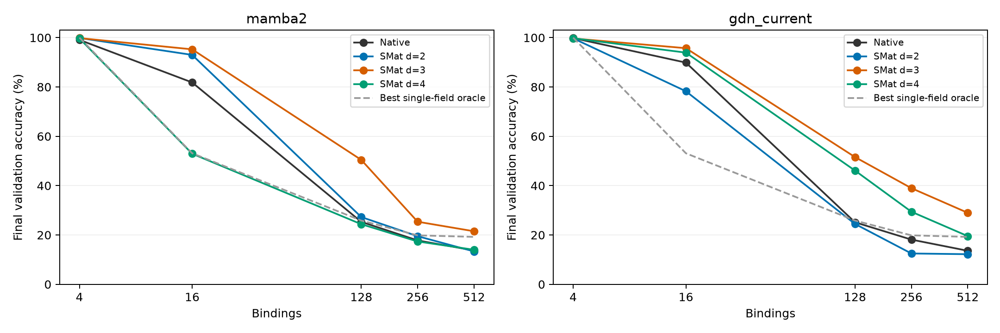
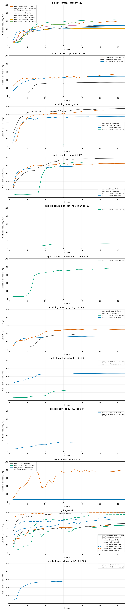

# Joint-recall development

Single seed123. All trials are retained. Validation guides iteration; the selected configuration still needs a fresh confirmation test. Incomplete training results are not final comparisons.

## Strongest completed settings on identical data

Each entry selects the highest final-epoch validation score among completed settings for that backbone and dataset. Pending settings can change these comparisons. This development table is not independent confirmation.

| Dataset | Backbone | Native validation (%) | SMat validation (%) | SMat minus native (pp) | Selected trials: native / SMat |
|---|---|---:|---:|---:|---|
| explicit_context_capacity512 | mamba2 | 47.55 | 58.48 | +10.93 | explicit_context_capacity512 / explicit_context_capacity512 (d=3) |
| explicit_context_capacity512 | gdn_current | 49.31 | 62.99 | +13.67 | explicit_context_capacity512 / explicit_context_capacity512 (d=3) |
| explicit_context_mixed | mamba2 | 97.57 | 91.47 | -6.09 | explicit_context_mixed_lr003 / explicit_context_mixed (d=3) |
| explicit_context_c8_k16 | gdn_current | 34.02 | 11.36 | -22.65 | explicit_context_c8_k16_stableinit / explicit_context_c8_k16_no_scalar_decay (d=3) |
| explicit_context_mixed | gdn_current | 78.59 | 87.64 | +9.05 | explicit_context_mixed_lr003 / explicit_context_mixed_lr003 (d=3) |
| explicit_context_c8_k16 | mamba2 | 39.35 | 79.63 | +40.28 | explicit_context_c8_k16_stableinit / explicit_context_c8_k16 (d=3) |
| joint_recall | gdn_current | 84.16 | 68.32 | -15.84 | joint_recall / joint_recall (d=3) |
| joint_recall | mamba2 | 72.86 | 68.99 | -3.87 | joint_recall / joint_recall (d=3) |

Every load is shown below for the selected completed settings. Datasets occupy separate panels; their training regimes are not interchangeable.

## Capacity sweep at the common learning rate

All dimensions below use LR0.003, weight decay0.1, width64, two layers, and seed123. Only completed 32-epoch runs appear in this table and plot; partial curves remain below.

| Backbone | Variant | 4 bindings | 16 bindings | 128 bindings | 256 bindings | 512 bindings | Macro (%) |
|---|---|---:|---:|---:|---:|---:|---:|
| mamba2 | Native | 99.10 | 81.84 | 25.31 | 17.79 | 13.71 | 47.55 |
| mamba2 | SMat d=2 | 99.88 | 93.01 | 27.26 | 19.50 | 13.32 | 50.59 |
| mamba2 | SMat d=3 | 99.83 | 95.26 | 50.44 | 25.37 | 21.50 | 58.48 |
| mamba2 | SMat d=4 | 99.70 | 52.94 | 24.37 | 17.35 | 14.01 | 41.67 |
| gdn_current | Native | 99.84 | 89.88 | 25.14 | 18.12 | 13.59 | 49.31 |
| gdn_current | SMat d=2 | 99.72 | 78.27 | 24.47 | 12.49 | 12.21 | 45.43 |
| gdn_current | SMat d=3 | 99.67 | 95.73 | 51.58 | 38.97 | 28.98 | 62.99 |
| gdn_current | SMat d=4 | 99.76 | 93.92 | 46.10 | 29.42 | 19.53 | 57.75 |

## All development runs

| Trial | Condition | Model | Epoch | Final/latest validation (%) | Best validation (%) | Complete |
|---|---|---|---:|---:|---:|---|
| explicit_context_capacity512 | shared | mamba2 SMat d3 | 32 | 58.48 | 59.57 | True |
| explicit_context_capacity512 | shared | gdn_current SMat d3 | 32 | 62.99 | 63.50 | True |
| explicit_context_capacity512 | shared | mamba2 native | 32 | 47.55 | 47.55 | True |
| explicit_context_capacity512 | shared | gdn_current native | 32 | 49.31 | 49.31 | True |
| explicit_context_capacity512_lr01 | shared | mamba2 SMat d3 | 32 | 55.04 | 55.04 | True |
| explicit_context_capacity512_lr01 | shared | mamba2 native | 32 | 33.94 | 33.95 | True |
| explicit_context_capacity512_lr01 | shared | gdn_current native | 32 | 48.82 | 48.82 | True |
| explicit_context_mixed | shared | mamba2 native | 32 | 95.02 | 95.02 | True |
| explicit_context_mixed | shared | mamba2 SMat d3 | 32 | 91.47 | 91.83 | True |
| explicit_context_mixed_lr003 | shared | mamba2 SMat d3 | 32 | 84.87 | 85.45 | True |
| explicit_context_mixed_lr003 | shared | mamba2 native | 32 | 97.57 | 97.57 | True |
| explicit_context_c8_k16_no_scalar_decay | shared | gdn_current SMat d3 | 32 | 11.36 | 11.41 | True |
| explicit_context_mixed_no_scalar_decay | shared | gdn_current SMat d3 | 32 | 76.78 | 76.78 | True |
| explicit_context_c8_k16_stableinit | shared | mamba2 SMat d3 | 32 | 50.09 | 51.42 | True |
| explicit_context_c8_k16_stableinit | shared | mamba2 native | 32 | 39.35 | 39.35 | True |
| explicit_context_mixed_stableinit | shared | gdn_current SMat d3 | 32 | 26.46 | 26.47 | True |
| explicit_context_mixed_stableinit | shared | gdn_current native | 32 | 67.62 | 67.62 | True |
| explicit_context_mixed_lr003 | shared | gdn_current SMat d3 | 32 | 87.64 | 88.98 | True |
| explicit_context_mixed_lr003 | shared | gdn_current native | 32 | 78.59 | 78.60 | True |
| explicit_context_c8_k16_stableinit | shared | gdn_current SMat d3 | 32 | 6.21 | 6.28 | True |
| explicit_context_c8_k16_stableinit | shared | gdn_current native | 32 | 34.02 | 34.02 | True |
| explicit_context_c8_k16_longinit | shared | gdn_current native | 32 | 22.79 | 23.40 | True |
| explicit_context_c8_k16_longinit | shared | gdn_current SMat d3 | 32 | 6.30 | 6.31 | True |
| explicit_context_mixed | shared | gdn_current native | 32 | 75.56 | 75.56 | True |
| explicit_context_c8_k16 | shared | mamba2 native | 32 | 6.27 | 6.29 | True |
| joint_recall | shared | gdn_current SMat d3 | 32 | 68.32 | 68.32 | True |
| joint_recall | shared | gdn_current native | 32 | 84.16 | 84.16 | True |
| joint_recall | shared | mamba2 SMat d3 | 32 | 68.99 | 68.99 | True |
| joint_recall | shared | mamba2 native | 32 | 72.86 | 72.86 | True |
| explicit_context_c8_k16 | shared | gdn_current SMat d3 | 32 | 6.28 | 6.33 | True |
| explicit_context_c8_k16 | shared | gdn_current native | 32 | 6.29 | 6.30 | True |
| explicit_context_c8_k16 | shared | mamba2 SMat d3 | 32 | 79.63 | 81.49 | True |
| explicit_context_mixed | shared | gdn_current SMat d3 | 32 | 6.31 | 6.45 | True |
| explicit_context_capacity512 | shared | mamba2 SMat d2 | 32 | 50.59 | 51.05 | True |
| explicit_context_capacity512 | shared | gdn_current SMat d2 | 32 | 45.43 | 45.44 | True |
| explicit_context_capacity512 | shared | mamba2 SMat d4 | 32 | 41.67 | 41.69 | True |
| explicit_context_capacity512 | shared | gdn_current SMat d4 | 32 | 57.75 | 58.91 | True |
| joint_recall | unique | gdn_current SMat d3 | 32 | 95.16 | 95.16 | True |
| joint_recall | unique | gdn_current native | 32 | 88.58 | 88.58 | True |
| joint_recall | unique | mamba2 SMat d3 | 32 | 99.99 | 99.99 | True |
| joint_recall | unique | mamba2 native | 32 | 99.92 | 99.92 | True |
| explicit_context_capacity512_lr004 | shared | gdn_current native | 15 | 55.62 | 55.62 | False |
| explicit_context_capacity512_lr004 | shared | gdn_current SMat d2 | 4 | 6.25 | 6.30 | False |

