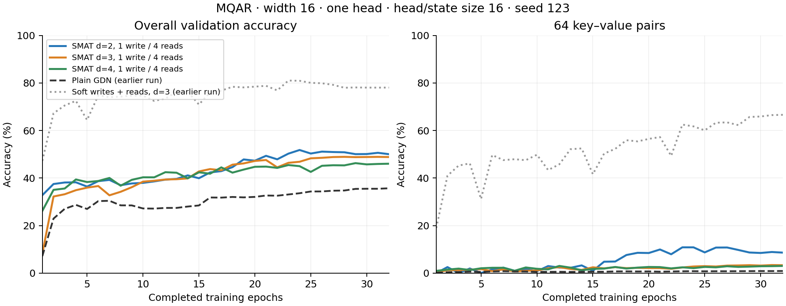

# MQAR: learned one-write, four-read SMAT

All three arms completed 32 epochs. Width 16, one GDN head, head/state size 16 (16 × 16 memory matrix), two layers, seed 123, learning rate 0.01, existing interleaved MQAR mixture. Each SMAT arm learns the write content hash and an independent weighted top-4 reader over distinct hyperplanes.

| Model | Final accuracy | Validation loss | 4 pairs | 8 pairs | 16 pairs | 32 pairs | 64 pairs |
|---|---:|---:|---:|---:|---:|---:|---:|
| GDN (historical) | 35.71% | 4.191 | 89.22% | 63.35% | 21.11% | 3.92% | 0.92% |
| GDN + SMAT d=2 | 50.04% | 6.098 | 98.58% | 83.08% | 37.65% | 22.26% | 8.64% |
| GDN + SMAT d=3 | 48.84% | 4.077 | 97.45% | 84.29% | 45.23% | 13.87% | 3.35% |
| GDN + SMAT d=4 | 46.03% | 4.202 | 94.50% | 78.14% | 41.44% | 13.04% | 3.05% |
| Soft writes + reads d=3 (historical) | 78.05% | 1.525 | 97.20% | 89.20% | 84.52% | 52.75% | 66.60% |

All three SMAT arms beat the historical GDN accuracy by 10.33–14.34 percentage points. This single seed shows no benefit from increasing d: d=2 finishes 1.20 points ahead of d=3 and 4.01 points ahead of d=4. It does not establish statistical equivalence or an ordering across seeds. Accuracy and loss differ: d=2 has the highest accuracy but worse loss than GDN.

The historical soft-write/soft-read reference is much stronger at 78.05%, especially on 64-pair examples (66.60%). That changes both writing and reading, so this comparison does not isolate which choice explains the gap.

For length 256, d=2/3/4 have 13/49/125 write buckets and 1/7/25 buckets per hyperplane. More buckets can reduce write interference, while larger hyperplanes combine more states at retrieval. The four reads are mixed by a weighted sum, not intersected. Four gathered summaries do not imply constant total scoring or summary-construction cost.

GPU preflight passed at all three lengths and d values; the real trainer checkpoint/resume smoke passed. No new routine CPU checks were added during Modal migration. d=2 epochs 1–7 ran on Slurm GH200; its full state resumed at epoch 8 on Modal H100. d=3/4 ran on Modal H100. Historical controls were not rerun in this sweep.

Best recorded accuracies (not final checkpoint selection): d=2: 51.80% at epoch 24, d=3: 48.92% at epoch 28, d=4: 46.28% at epoch 29.

Final checkpoints, status JSON, 32-epoch histories, and training logs are saved beside this report. Raw metrics: [final_metrics.csv](final_metrics.csv). Frozen recipe and source are in ../w16_h1_hd16_state16_s123/. Modal volume: smat-mqar-four-reads-results, prefix four_reads_w16_s123/.

Modal app ap-4isCxDz7XqUcfU7xwrXPXi completed and stopped with zero tasks; all predecessor apps are also stopped. Slurm fallback jobs were canceled and dispatcher STOP remains set.
