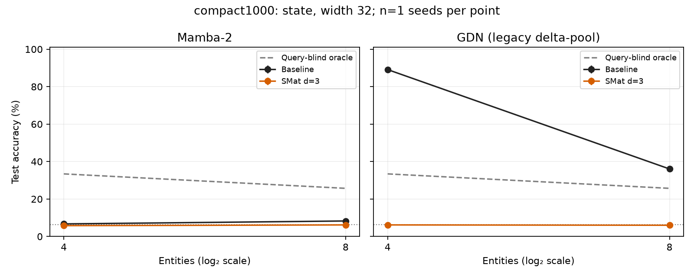
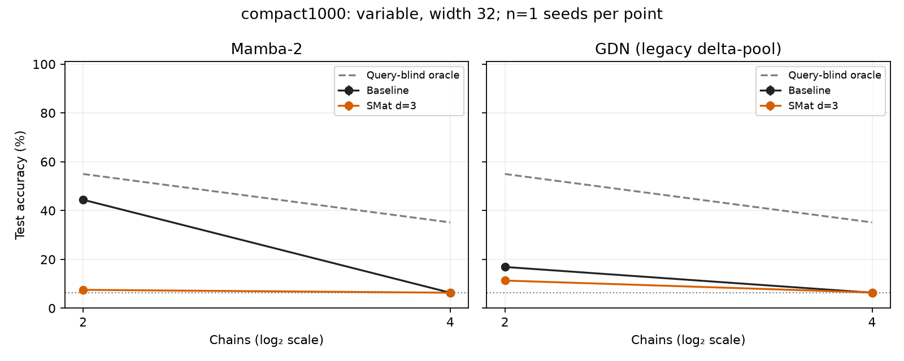
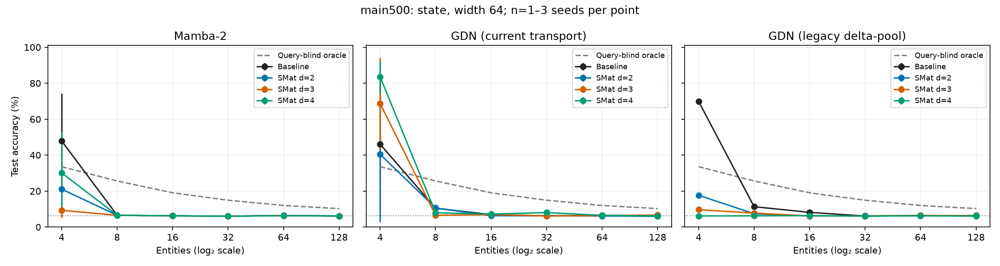
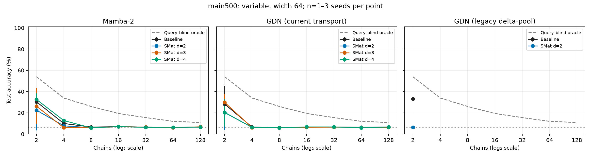
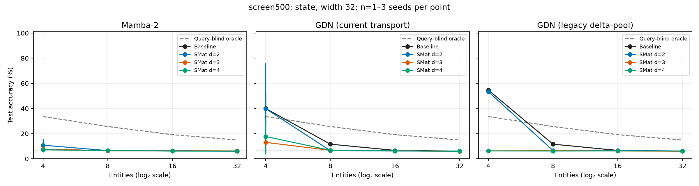
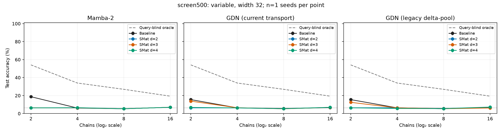
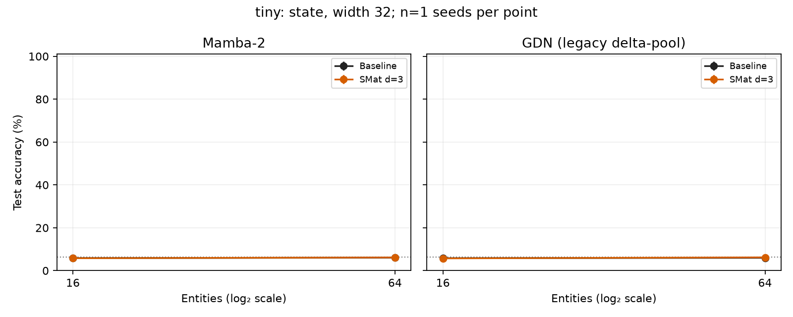
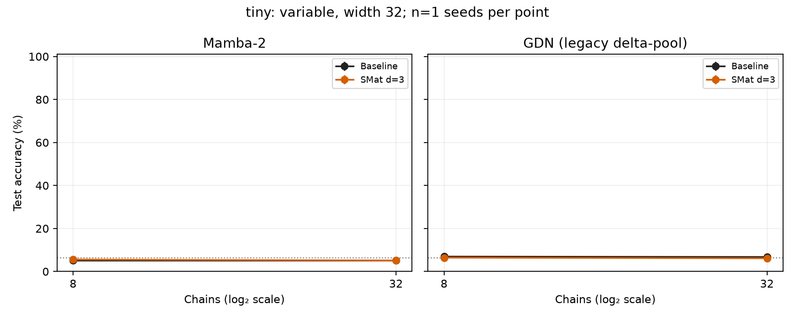
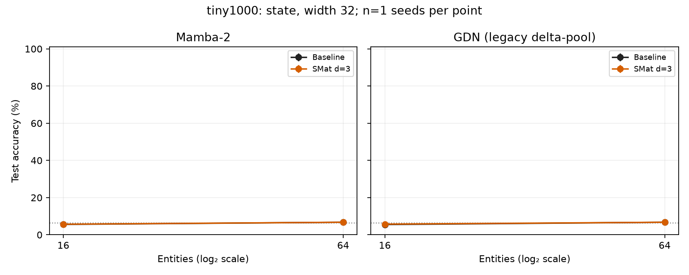
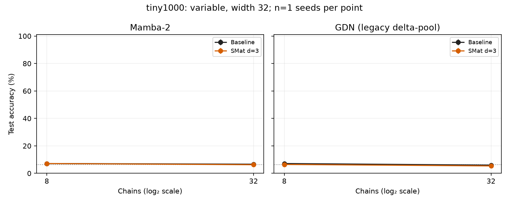

# Synthetic memory experiments

Final-step, independent-test accuracy; chance = 6.25% (16 equiprobable values). Unrestricted vocabulary predictions. Missing cells are pending, not zero. Single-seed results are preliminary. Error bars are sample standard deviations across seeds, not confidence intervals.

## compact1000: state, width 32

| Model | Load | Seeds | Accuracy (%) | Exact set (%) | Binding gap (pp) | Parameters |
|---|---:|---:|---:|---:|---:|---:|
| GDN (legacy delta-pool) | 4 | 1 | 89.11 | 60.94 | — | 20,200 |
| GDN (legacy delta-pool) | 8 | 1 | 36.06 | 1.56 | — | 20,200 |
| GDN (legacy delta-pool) + SMat d=3 | 4 | 1 | 6.18 | 0.00 | — | 27,640 |
| GDN (legacy delta-pool) + SMat d=3 | 8 | 1 | 6.01 | 0.00 | — | 27,640 |
| Mamba-2 | 4 | 1 | 6.71 | 0.00 | — | 24,856 |
| Mamba-2 | 8 | 1 | 8.28 | 0.00 | — | 24,856 |
| Mamba-2 + SMat d=3 | 4 | 1 | 5.79 | 0.00 | — | 35,392 |
| Mamba-2 + SMat d=3 | 8 | 1 | 6.18 | 0.00 | — | 35,392 |

[Learning curves](compact1000-state-w32-curves.png)

| Load | Query-blind majority (%) | Query-blind last value (%) | Query-blind oracle (%) |
|---:|---:|---:|---:|---:|
| 4 | 21.83 | 29.59 | 33.42 |
| 8 | 15.84 | 18.26 | 25.71 |

## compact1000: variable, width 32

| Model | Load | Seeds | Accuracy (%) | Exact set (%) | Binding gap (pp) | Parameters |
|---|---:|---:|---:|---:|---:|---:|
| GDN (legacy delta-pool) | 2 | 1 | 16.89 | 16.89 | — | 28,392 |
| GDN (legacy delta-pool) | 4 | 1 | 6.35 | 6.35 | — | 28,392 |
| GDN (legacy delta-pool) + SMat d=3 | 2 | 1 | 11.33 | 11.33 | — | 35,832 |
| GDN (legacy delta-pool) + SMat d=3 | 4 | 1 | 6.45 | 6.45 | — | 35,832 |
| Mamba-2 | 2 | 1 | 44.43 | 44.43 | — | 33,048 |
| Mamba-2 | 4 | 1 | 6.35 | 6.35 | — | 33,048 |
| Mamba-2 + SMat d=3 | 2 | 1 | 7.52 | 7.52 | — | 43,584 |
| Mamba-2 + SMat d=3 | 4 | 1 | 6.35 | 6.35 | — | 43,584 |

[Learning curves](compact1000-variable-w32-curves.png)

| Load | Query-blind majority (%) | Query-blind last value (%) | Query-blind oracle (%) |
|---:|---:|---:|---:|---:|
| 2 | 54.98 | 52.83 | 54.98 |
| 4 | 35.16 | 30.08 | 35.16 |

## main500: state, width 64

| Model | Load | Seeds | Accuracy (%) | Exact set (%) | Binding gap (pp) | Parameters |
|---|---:|---:|---:|---:|---:|---:|
| GDN (legacy delta-pool) | 4 | 1 | 69.87 | 21.46 | 61.08 | 39,592 |
| GDN (legacy delta-pool) | 8 | 1 | 11.33 | 0.00 | -0.05 | 39,592 |
| GDN (legacy delta-pool) | 16 | 1 | 8.18 | 0.00 | 0.16 | 39,592 |
| GDN (legacy delta-pool) | 32 | 1 | 6.14 | 0.00 | -0.00 | 39,592 |
| GDN (legacy delta-pool) | 64 | 1 | 6.36 | 0.00 | -0.03 | 39,592 |
| GDN (legacy delta-pool) | 128 | 1 | 6.31 | 0.00 | 0.05 | 39,592 |
| GDN (legacy delta-pool) + SMat d=2 | 4 | 1 | 17.69 | 0.00 | 6.17 | 46,548 |
| GDN (legacy delta-pool) + SMat d=2 | 8 | 1 | 7.42 | 0.00 | 0.09 | 47,588 |
| GDN (legacy delta-pool) + SMat d=2 | 16 | 1 | 6.20 | 0.00 | -0.21 | 48,108 |
| GDN (legacy delta-pool) + SMat d=2 | 32 | 1 | 6.26 | 0.00 | 0.13 | 48,108 |
| GDN (legacy delta-pool) + SMat d=2 | 64 | 1 | 6.28 | 0.00 | -0.03 | 49,148 |
| GDN (legacy delta-pool) + SMat d=2 | 128 | 1 | 6.45 | 0.00 | 0.35 | 50,708 |
| GDN (legacy delta-pool) + SMat d=3 | 4 | 1 | 9.70 | 0.00 | 0.04 | 54,328 |
| GDN (legacy delta-pool) + SMat d=3 | 8 | 1 | 7.76 | 0.00 | -0.13 | 54,328 |
| GDN (legacy delta-pool) + SMat d=3 | 16 | 1 | 6.21 | 0.00 | -0.18 | 61,600 |
| GDN (legacy delta-pool) + SMat d=3 | 32 | 1 | 6.20 | 0.00 | 0.10 | 61,600 |
| GDN (legacy delta-pool) + SMat d=3 | 64 | 1 | 6.49 | 0.00 | 0.15 | 61,600 |
| GDN (legacy delta-pool) + SMat d=3 | 128 | 1 | 6.28 | 0.00 | 0.09 | 82,384 |
| GDN (legacy delta-pool) + SMat d=4 | 4 | 1 | 6.21 | 0.00 | 0.05 | 58,724 |
| GDN (legacy delta-pool) + SMat d=4 | 8 | 1 | 6.26 | 0.00 | -0.08 | 58,724 |
| GDN (legacy delta-pool) + SMat d=4 | 16 | 1 | 6.38 | 0.00 | 0.02 | 93,492 |
| GDN (legacy delta-pool) + SMat d=4 | 32 | 1 | 6.09 | 0.00 | -0.13 | 93,492 |
| GDN (legacy delta-pool) + SMat d=4 | 64 | 1 | 6.26 | 0.00 | -0.13 | 93,492 |
| GDN (legacy delta-pool) + SMat d=4 | 128 | 1 | 6.08 | 0.00 | -0.14 | 93,492 |
| GDN (current transport) | 4 | 3 | 46.08 ± 36.51 | 15.64 ± 24.03 | 36.53 ± 36.36 | 39,592 |
| GDN (current transport) | 8 | 1 | 10.49 | 0.00 | 0.13 | 39,592 |
| GDN (current transport) | 16 | 3 | 6.94 ± 0.82 | 0.00 ± 0.00 | -0.00 ± 0.01 | 39,592 |
| GDN (current transport) | 32 | 1 | 6.25 | 0.00 | -0.00 | 39,592 |
| GDN (current transport) | 64 | 1 | 6.45 | 0.00 | 0.09 | 39,592 |
| GDN (current transport) | 128 | 1 | 6.07 | 0.00 | -0.16 | 39,592 |
| GDN (current transport) + SMat d=2 | 4 | 3 | 40.45 ± 37.52 | 14.19 ± 24.56 | 26.10 ± 40.35 | 46,548 |
| GDN (current transport) + SMat d=2 | 8 | 1 | 10.63 | 0.00 | -0.01 | 47,588 |
| GDN (current transport) + SMat d=2 | 16 | 3 | 6.34 ± 0.20 | 0.00 ± 0.00 | 0.09 ± 0.11 | 48,108 |
| GDN (current transport) + SMat d=2 | 32 | 1 | 6.27 | 0.00 | 0.12 | 48,108 |
| GDN (current transport) + SMat d=2 | 64 | 1 | 6.18 | 0.00 | -0.17 | 49,148 |
| GDN (current transport) + SMat d=2 | 128 | 1 | 6.01 | 0.00 | -0.17 | 50,708 |
| GDN (current transport) + SMat d=3 | 4 | 3 | 68.70 ± 25.39 | 30.38 ± 25.19 | 57.74 ± 27.70 | 54,328 |
| GDN (current transport) + SMat d=3 | 8 | 1 | 6.59 | 0.00 | -0.08 | 54,328 |
| GDN (current transport) + SMat d=3 | 16 | 3 | 6.94 ± 1.17 | 0.00 ± 0.00 | 0.03 ± 0.13 | 61,600 |
| GDN (current transport) + SMat d=3 | 32 | 1 | 6.15 | 0.00 | 0.01 | 61,600 |
| GDN (current transport) + SMat d=3 | 64 | 1 | 6.46 | 0.00 | 0.07 | 61,600 |
| GDN (current transport) + SMat d=3 | 128 | 1 | 6.70 | 0.00 | 0.44 | 82,384 |
| GDN (current transport) + SMat d=4 | 4 | 3 | 83.57 ± 9.08 | 48.53 ± 22.58 | 74.48 ± 10.68 | 58,724 |
| GDN (current transport) + SMat d=4 | 8 | 1 | 7.97 | 0.00 | -0.01 | 58,724 |
| GDN (current transport) + SMat d=4 | 16 | 3 | 7.25 ± 1.55 | 0.00 ± 0.00 | 0.01 ± 0.17 | 93,492 |
| GDN (current transport) + SMat d=4 | 32 | 1 | 8.08 | 0.00 | 0.40 | 93,492 |
| GDN (current transport) + SMat d=4 | 64 | 1 | 6.52 | 0.00 | -0.04 | 93,492 |
| GDN (current transport) + SMat d=4 | 128 | 1 | 6.20 | 0.00 | 0.02 | 93,492 |
| Mamba-2 | 4 | 3 | 47.93 ± 26.41 | 7.07 ± 6.96 | 32.51 ± 28.48 | 74,480 |
| Mamba-2 | 8 | 1 | 6.59 | 0.00 | 0.02 | 74,480 |
| Mamba-2 | 16 | 3 | 6.26 ± 0.09 | 0.00 ± 0.00 | 0.03 ± 0.05 | 74,480 |
| Mamba-2 | 32 | 1 | 6.09 | 0.00 | -0.05 | 74,480 |
| Mamba-2 | 64 | 1 | 6.43 | 0.00 | 0.07 | 74,480 |
| Mamba-2 | 128 | 1 | 6.13 | 0.00 | -0.05 | 74,480 |
| Mamba-2 + SMat d=2 | 4 | 3 | 21.08 ± 15.29 | 0.15 ± 0.27 | 7.07 ± 12.23 | 84,912 |
| Mamba-2 + SMat d=2 | 8 | 1 | 6.59 | 0.02 | 0.05 | 89,072 |
| Mamba-2 + SMat d=2 | 16 | 3 | 6.26 ± 0.23 | 0.00 ± 0.00 | 0.00 ± 0.21 | 91,152 |
| Mamba-2 + SMat d=2 | 32 | 1 | 6.03 | 0.00 | -0.06 | 91,152 |
| Mamba-2 + SMat d=2 | 64 | 1 | 6.46 | 0.00 | 0.02 | 95,312 |
| Mamba-2 + SMat d=2 | 128 | 1 | 6.20 | 0.02 | -0.05 | 101,552 |
| Mamba-2 + SMat d=3 | 4 | 3 | 9.32 ± 4.09 | 0.00 ± 0.00 | -0.01 ± 0.30 | 116,032 |
| Mamba-2 + SMat d=3 | 8 | 1 | 6.58 | 0.00 | -0.08 | 116,032 |
| Mamba-2 + SMat d=3 | 16 | 3 | 6.22 ± 0.09 | 0.00 ± 0.00 | -0.01 ± 0.05 | 145,120 |
| Mamba-2 + SMat d=3 | 32 | 1 | 6.12 | 0.00 | 0.01 | 145,120 |
| Mamba-2 + SMat d=3 | 64 | 1 | 6.43 | 0.00 | 0.07 | 145,120 |
| Mamba-2 + SMat d=3 | 128 | 1 | 6.13 | 0.00 | -0.08 | 228,256 |
| Mamba-2 + SMat d=4 | 4 | 3 | 30.16 ± 22.60 | 1.82 ± 3.16 | 14.35 ± 24.37 | 133,616 |
| Mamba-2 + SMat d=4 | 8 | 1 | 6.59 | 0.00 | -0.10 | 133,616 |
| Mamba-2 + SMat d=4 | 16 | 3 | 6.28 ± 0.11 | 0.00 ± 0.00 | 0.02 ± 0.03 | 272,688 |
| Mamba-2 + SMat d=4 | 32 | 1 | 6.09 | 0.00 | 0.10 | 272,688 |
| Mamba-2 + SMat d=4 | 64 | 1 | 6.30 | 0.00 | 0.09 | 272,688 |
| Mamba-2 + SMat d=4 | 128 | 1 | 6.19 | 0.00 | 0.01 | 272,688 |

[Learning curves](main500-state-w64-curves.png)

| Load | Query-blind majority (%) | Query-blind last value (%) | Query-blind oracle (%) |
|---:|---:|---:|---:|---:|
| 4 | 21.49 | 29.63 | 33.60 |
| 8 | 16.67 | 18.07 | 25.66 |
| 16 | 13.03 | 12.03 | 19.07 |
| 32 | 10.94 | 9.23 | 14.95 |
| 64 | 9.35 | 7.86 | 12.02 |
| 128 | 8.45 | 7.14 | 10.28 |

## main500: variable, width 64

| Model | Load | Seeds | Accuracy (%) | Exact set (%) | Binding gap (pp) | Parameters |
|---|---:|---:|---:|---:|---:|---:|
| GDN (legacy delta-pool) | 2 | 1 | 33.06 | 33.06 | -1.59 | 55,976 |
| GDN (legacy delta-pool) + SMat d=2 | 2 | 1 | 6.42 | 6.42 | 0.56 | 62,932 |
| GDN (current transport) | 2 | 3 | 28.25 ± 17.25 | 28.25 ± 17.25 | -1.33 ± 1.34 | 55,976 |
| GDN (current transport) | 4 | 1 | 6.62 | 6.62 | 0.10 | 55,976 |
| GDN (current transport) | 8 | 3 | 6.07 ± 0.13 | 6.07 ± 0.13 | -0.23 ± 0.10 | 55,976 |
| GDN (current transport) | 16 | 1 | 6.49 | 6.49 | 0.37 | 55,976 |
| GDN (current transport) | 32 | 1 | 6.62 | 6.62 | 0.42 | 55,976 |
| GDN (current transport) | 64 | 1 | 6.42 | 6.42 | 0.06 | 55,976 |
| GDN (current transport) | 128 | 1 | 6.54 | 6.54 | 0.29 | 55,976 |
| GDN (current transport) + SMat d=2 | 2 | 3 | 20.37 ± 16.38 | 20.37 ± 16.38 | 0.05 ± 1.07 | 62,932 |
| GDN (current transport) + SMat d=2 | 4 | 1 | 6.32 | 6.32 | 0.12 | 62,932 |
| GDN (current transport) + SMat d=2 | 8 | 3 | 5.88 ± 0.50 | 5.88 ± 0.50 | -0.34 ± 0.47 | 63,972 |
| GDN (current transport) + SMat d=2 | 16 | 1 | 6.54 | 6.54 | 0.31 | 64,492 |
| GDN (current transport) + SMat d=2 | 32 | 1 | 6.52 | 6.52 | 0.36 | 64,492 |
| GDN (current transport) + SMat d=2 | 64 | 1 | 6.23 | 6.23 | -0.14 | 65,532 |
| GDN (current transport) + SMat d=2 | 128 | 1 | 6.67 | 6.67 | 0.37 | 67,092 |
| GDN (current transport) + SMat d=3 | 2 | 3 | 29.83 ± 8.02 | 29.83 ± 8.02 | 0.81 ± 0.93 | 70,712 |
| GDN (current transport) + SMat d=3 | 4 | 1 | 6.15 | 6.15 | 0.20 | 70,712 |
| GDN (current transport) + SMat d=3 | 8 | 3 | 5.86 ± 0.36 | 5.86 ± 0.36 | -0.44 ± 0.34 | 70,712 |
| GDN (current transport) + SMat d=3 | 16 | 1 | 6.30 | 6.30 | 0.17 | 77,984 |
| GDN (current transport) + SMat d=3 | 32 | 1 | 6.57 | 6.57 | 0.32 | 77,984 |
| GDN (current transport) + SMat d=3 | 64 | 1 | 6.08 | 6.08 | -0.26 | 77,984 |
| GDN (current transport) + SMat d=3 | 128 | 1 | 6.25 | 6.25 | 0.02 | 98,768 |
| GDN (current transport) + SMat d=4 | 2 | 3 | 20.22 ± 12.90 | 20.22 ± 12.90 | -0.39 ± 0.81 | 75,108 |
| GDN (current transport) + SMat d=4 | 4 | 1 | 6.32 | 6.32 | 0.01 | 75,108 |
| GDN (current transport) + SMat d=4 | 8 | 3 | 5.88 ± 0.45 | 5.88 ± 0.45 | -0.40 ± 0.41 | 75,108 |
| GDN (current transport) + SMat d=4 | 16 | 1 | 6.69 | 6.69 | 0.60 | 109,876 |
| GDN (current transport) + SMat d=4 | 32 | 1 | 6.69 | 6.69 | 0.49 | 109,876 |
| GDN (current transport) + SMat d=4 | 64 | 1 | 5.91 | 5.91 | -0.41 | 109,876 |
| GDN (current transport) + SMat d=4 | 128 | 1 | 6.64 | 6.64 | 0.39 | 109,876 |
| Mamba-2 | 2 | 3 | 30.43 ± 3.23 | 30.43 ± 3.23 | 0.18 ± 1.23 | 90,864 |
| Mamba-2 | 4 | 1 | 9.96 | 9.96 | 0.29 | 90,864 |
| Mamba-2 | 8 | 3 | 6.56 ± 1.51 | 6.56 ± 1.51 | -0.55 ± 0.38 | 90,864 |
| Mamba-2 | 16 | 1 | 6.93 | 6.93 | 0.79 | 90,864 |
| Mamba-2 | 32 | 1 | 6.52 | 6.52 | 0.26 | 90,864 |
| Mamba-2 | 64 | 1 | 6.15 | 6.15 | -0.17 | 90,864 |
| Mamba-2 | 128 | 1 | 6.57 | 6.57 | 0.30 | 90,864 |
| Mamba-2 + SMat d=2 | 2 | 3 | 22.51 ± 18.93 | 22.51 ± 18.93 | -0.62 ± 1.97 | 101,296 |
| Mamba-2 + SMat d=2 | 4 | 1 | 7.74 | 7.74 | -0.40 | 101,296 |
| Mamba-2 + SMat d=2 | 8 | 3 | 5.96 ± 0.54 | 5.96 ± 0.54 | -0.32 ± 0.51 | 105,456 |
| Mamba-2 + SMat d=2 | 16 | 1 | 6.91 | 6.91 | 0.78 | 107,536 |
| Mamba-2 + SMat d=2 | 32 | 1 | 6.52 | 6.52 | 0.26 | 107,536 |
| Mamba-2 + SMat d=2 | 64 | 1 | 6.13 | 6.13 | -0.19 | 111,696 |
| Mamba-2 + SMat d=2 | 128 | 1 | 6.71 | 6.71 | 0.48 | 117,936 |
| Mamba-2 + SMat d=3 | 2 | 3 | 26.24 ± 16.96 | 26.24 ± 16.96 | -0.34 ± 0.13 | 132,416 |
| Mamba-2 + SMat d=3 | 4 | 1 | 6.05 | 6.05 | 0.28 | 132,416 |
| Mamba-2 + SMat d=3 | 8 | 3 | 5.87 ± 0.45 | 5.87 ± 0.45 | -0.42 ± 0.39 | 132,416 |
| Mamba-2 + SMat d=3 | 16 | 1 | 6.96 | 6.96 | 0.91 | 161,504 |
| Mamba-2 + SMat d=3 | 32 | 1 | 6.49 | 6.49 | 0.26 | 161,504 |
| Mamba-2 + SMat d=3 | 64 | 1 | 6.15 | 6.15 | -0.17 | 161,504 |
| Mamba-2 + SMat d=3 | 128 | 1 | 6.79 | 6.79 | 0.51 | 244,640 |
| Mamba-2 + SMat d=4 | 2 | 3 | 32.64 ± 5.89 | 32.64 ± 5.89 | -0.94 ± 0.57 | 150,000 |
| Mamba-2 + SMat d=4 | 4 | 1 | 12.72 | 12.72 | -0.90 | 150,000 |
| Mamba-2 + SMat d=4 | 8 | 3 | 5.87 ± 0.45 | 5.87 ± 0.45 | -0.41 ± 0.40 | 150,000 |
| Mamba-2 + SMat d=4 | 16 | 1 | 7.01 | 7.01 | 0.89 | 289,072 |
| Mamba-2 + SMat d=4 | 32 | 1 | 6.27 | 6.27 | 0.03 | 289,072 |
| Mamba-2 + SMat d=4 | 64 | 1 | 6.37 | 6.37 | 0.08 | 289,072 |
| Mamba-2 + SMat d=4 | 128 | 1 | 6.54 | 6.54 | 0.32 | 289,072 |

[Learning curves](main500-variable-w64-curves.png)

| Load | Query-blind majority (%) | Query-blind last value (%) | Query-blind oracle (%) |
|---:|---:|---:|---:|---:|
| 2 | 54.00 | 53.10 | 54.00 |
| 4 | 33.94 | 30.00 | 33.94 |
| 8 | 26.02 | 18.20 | 26.02 |
| 16 | 19.34 | 13.33 | 19.34 |
| 32 | 15.50 | 9.03 | 15.50 |
| 64 | 11.96 | 7.47 | 11.96 |
| 128 | 10.86 | 6.81 | 10.86 |

## screen500: state, width 32

| Model | Load | Seeds | Accuracy (%) | Exact set (%) | Binding gap (pp) | Parameters |
|---|---:|---:|---:|---:|---:|---:|
| GDN (legacy delta-pool) | 4 | 1 | 54.68 | 6.47 | — | 20,200 |
| GDN (legacy delta-pool) | 8 | 1 | 11.63 | 0.02 | — | 20,200 |
| GDN (legacy delta-pool) | 16 | 1 | 6.67 | 0.00 | — | 20,200 |
| GDN (legacy delta-pool) | 32 | 1 | 6.09 | 0.00 | — | 20,200 |
| GDN (legacy delta-pool) + SMat d=2 | 4 | 1 | 53.39 | 4.03 | — | 23,700 |
| GDN (legacy delta-pool) + SMat d=2 | 8 | 1 | 6.57 | 0.00 | — | 24,228 |
| GDN (legacy delta-pool) + SMat d=2 | 16 | 1 | 6.45 | 0.00 | — | 24,492 |
| GDN (legacy delta-pool) + SMat d=2 | 32 | 1 | 6.16 | 0.00 | — | 24,492 |
| GDN (legacy delta-pool) + SMat d=3 | 4 | 1 | 6.29 | 0.00 | — | 27,640 |
| GDN (legacy delta-pool) + SMat d=3 | 8 | 1 | 6.43 | 0.00 | — | 27,640 |
| GDN (legacy delta-pool) + SMat d=3 | 16 | 1 | 6.22 | 0.00 | — | 31,328 |
| GDN (legacy delta-pool) + SMat d=3 | 32 | 1 | 6.10 | 0.00 | — | 31,328 |
| GDN (legacy delta-pool) + SMat d=4 | 4 | 1 | 6.24 | 0.00 | — | 29,860 |
| GDN (legacy delta-pool) + SMat d=4 | 8 | 1 | 6.20 | 0.00 | — | 29,860 |
| GDN (legacy delta-pool) + SMat d=4 | 16 | 1 | 6.25 | 0.00 | — | 47,476 |
| GDN (legacy delta-pool) + SMat d=4 | 32 | 1 | 6.21 | 0.00 | — | 47,476 |
| GDN (current transport) | 4 | 3 | 40.01 ± 12.85 | 2.29 ± 3.62 | 24.74 ± 15.77 | 20,200 |
| GDN (current transport) | 8 | 1 | 11.63 | 0.02 | 1.40 | 20,200 |
| GDN (current transport) | 16 | 1 | 6.67 | 0.00 | 0.33 | 20,200 |
| GDN (current transport) | 32 | 1 | 6.09 | 0.00 | -0.04 | 20,200 |
| GDN (current transport) + SMat d=2 | 4 | 3 | 39.84 ± 36.30 | 13.61 ± 23.27 | 30.86 ± 35.48 | 23,700 |
| GDN (current transport) + SMat d=2 | 8 | 1 | 6.51 | 0.00 | 0.14 | 24,228 |
| GDN (current transport) + SMat d=2 | 16 | 1 | 6.19 | 0.00 | -0.28 | 24,492 |
| GDN (current transport) + SMat d=2 | 32 | 1 | 6.13 | 0.00 | 0.12 | 24,492 |
| GDN (current transport) + SMat d=3 | 4 | 3 | 13.07 ± 6.49 | 0.02 ± 0.01 | 0.08 ± 0.21 | 27,640 |
| GDN (current transport) + SMat d=3 | 8 | 1 | 6.72 | 0.00 | 0.24 | 27,640 |
| GDN (current transport) + SMat d=3 | 16 | 1 | 6.42 | 0.00 | 0.05 | 31,328 |
| GDN (current transport) + SMat d=3 | 32 | 1 | 5.93 | 0.00 | -0.27 | 31,328 |
| GDN (current transport) + SMat d=4 | 4 | 3 | 17.74 ± 13.95 | 0.25 ± 0.44 | 7.05 ± 10.55 | 29,860 |
| GDN (current transport) + SMat d=4 | 8 | 1 | 6.76 | 0.00 | 0.06 | 29,860 |
| GDN (current transport) + SMat d=4 | 16 | 1 | 6.35 | 0.00 | -0.04 | 47,476 |
| GDN (current transport) + SMat d=4 | 32 | 1 | 5.99 | 0.00 | -0.04 | 47,476 |
| Mamba-2 | 4 | 3 | 7.60 ± 2.11 | 0.00 ± 0.00 | 0.12 ± 0.12 | 24,856 |
| Mamba-2 | 8 | 1 | 6.45 | 0.00 | — | 24,856 |
| Mamba-2 | 16 | 1 | 6.43 | 0.00 | — | 24,856 |
| Mamba-2 | 32 | 1 | 6.13 | 0.00 | — | 24,856 |
| Mamba-2 + SMat d=2 | 4 | 3 | 10.81 ± 5.00 | 0.00 ± 0.00 | 2.04 ± 2.69 | 27,512 |
| Mamba-2 + SMat d=2 | 8 | 1 | 6.52 | 0.00 | — | 28,568 |
| Mamba-2 + SMat d=2 | 16 | 1 | 6.40 | 0.00 | — | 29,096 |
| Mamba-2 + SMat d=2 | 32 | 1 | 6.09 | 0.00 | — | 29,096 |
| Mamba-2 + SMat d=3 | 4 | 3 | 7.69 ± 2.63 | 0.00 ± 0.00 | 0.01 ± 0.07 | 35,392 |
| Mamba-2 + SMat d=3 | 8 | 1 | 6.33 | 0.00 | — | 35,392 |
| Mamba-2 + SMat d=3 | 16 | 1 | 6.30 | 0.00 | — | 42,768 |
| Mamba-2 + SMat d=3 | 32 | 1 | 6.26 | 0.00 | — | 42,768 |
| Mamba-2 + SMat d=4 | 4 | 3 | 7.15 ± 1.37 | 0.01 ± 0.01 | 0.04 ± 0.12 | 39,832 |
| Mamba-2 + SMat d=4 | 8 | 1 | 6.55 | 0.00 | — | 39,832 |
| Mamba-2 + SMat d=4 | 16 | 1 | 6.14 | 0.00 | — | 75,064 |
| Mamba-2 + SMat d=4 | 32 | 1 | 6.09 | 0.00 | — | 75,064 |

[Learning curves](screen500-state-w32-curves.png)

| Load | Query-blind majority (%) | Query-blind last value (%) | Query-blind oracle (%) |
|---:|---:|---:|---:|---:|
| 4 | 21.49 | 29.63 | 33.60 |
| 8 | 16.67 | 18.07 | 25.66 |
| 16 | 12.99 | 12.23 | 19.19 |
| 32 | 10.94 | 9.23 | 14.95 |

## screen500: variable, width 32

| Model | Load | Seeds | Accuracy (%) | Exact set (%) | Binding gap (pp) | Parameters |
|---|---:|---:|---:|---:|---:|---:|
| GDN (legacy delta-pool) | 2 | 1 | 15.50 | 15.50 | — | 28,392 |
| GDN (legacy delta-pool) | 4 | 1 | 6.35 | 6.35 | — | 28,392 |
| GDN (legacy delta-pool) | 8 | 1 | 5.59 | 5.59 | — | 28,392 |
| GDN (legacy delta-pool) | 16 | 1 | 6.57 | 6.57 | — | 28,392 |
| GDN (legacy delta-pool) + SMat d=2 | 2 | 1 | 6.40 | 6.40 | — | 31,892 |
| GDN (legacy delta-pool) + SMat d=2 | 4 | 1 | 6.45 | 6.45 | — | 31,892 |
| GDN (legacy delta-pool) + SMat d=2 | 8 | 1 | 5.35 | 5.35 | — | 32,420 |
| GDN (legacy delta-pool) + SMat d=2 | 16 | 1 | 6.96 | 6.96 | — | 32,684 |
| GDN (legacy delta-pool) + SMat d=3 | 2 | 1 | 12.48 | 12.48 | — | 35,832 |
| GDN (legacy delta-pool) + SMat d=3 | 4 | 1 | 6.32 | 6.32 | — | 35,832 |
| GDN (legacy delta-pool) + SMat d=3 | 8 | 1 | 5.40 | 5.40 | — | 35,832 |
| GDN (legacy delta-pool) + SMat d=3 | 16 | 1 | 6.18 | 6.18 | — | 39,520 |
| GDN (legacy delta-pool) + SMat d=4 | 2 | 1 | 6.40 | 6.40 | — | 38,052 |
| GDN (legacy delta-pool) + SMat d=4 | 4 | 1 | 5.66 | 5.66 | — | 38,052 |
| GDN (legacy delta-pool) + SMat d=4 | 8 | 1 | 5.49 | 5.49 | — | 38,052 |
| GDN (legacy delta-pool) + SMat d=4 | 16 | 1 | 7.20 | 7.20 | — | 55,668 |
| GDN (current transport) | 2 | 1 | 15.50 | 15.50 | 1.22 | 28,392 |
| GDN (current transport) | 4 | 1 | 6.35 | 6.35 | 0.16 | 28,392 |
| GDN (current transport) | 8 | 1 | 5.59 | 5.59 | -0.51 | 28,392 |
| GDN (current transport) | 16 | 1 | 6.57 | 6.57 | 0.48 | 28,392 |
| GDN (current transport) + SMat d=2 | 2 | 1 | 6.35 | 6.35 | 0.37 | 31,892 |
| GDN (current transport) + SMat d=2 | 4 | 1 | 6.27 | 6.27 | 0.13 | 31,892 |
| GDN (current transport) + SMat d=2 | 8 | 1 | 5.37 | 5.37 | -0.84 | 32,420 |
| GDN (current transport) + SMat d=2 | 16 | 1 | 6.79 | 6.79 | 0.64 | 32,684 |
| GDN (current transport) + SMat d=3 | 2 | 1 | 13.79 | 13.79 | 0.22 | 35,832 |
| GDN (current transport) + SMat d=3 | 4 | 1 | 6.42 | 6.42 | 0.04 | 35,832 |
| GDN (current transport) + SMat d=3 | 8 | 1 | 5.30 | 5.30 | -0.88 | 35,832 |
| GDN (current transport) + SMat d=3 | 16 | 1 | 6.86 | 6.86 | 0.77 | 39,520 |
| GDN (current transport) + SMat d=4 | 2 | 1 | 6.79 | 6.79 | 0.34 | 38,052 |
| GDN (current transport) + SMat d=4 | 4 | 1 | 6.27 | 6.27 | 0.28 | 38,052 |
| GDN (current transport) + SMat d=4 | 8 | 1 | 5.42 | 5.42 | -0.83 | 38,052 |
| GDN (current transport) + SMat d=4 | 16 | 1 | 6.91 | 6.91 | 0.73 | 55,668 |
| Mamba-2 | 2 | 1 | 18.73 | 18.73 | — | 33,048 |
| Mamba-2 | 4 | 1 | 6.10 | 6.10 | — | 33,048 |
| Mamba-2 | 8 | 1 | 5.35 | 5.35 | — | 33,048 |
| Mamba-2 | 16 | 1 | 6.98 | 6.98 | — | 33,048 |
| Mamba-2 + SMat d=2 | 2 | 1 | 6.37 | 6.37 | — | 35,704 |
| Mamba-2 + SMat d=2 | 4 | 1 | 6.27 | 6.27 | — | 35,704 |
| Mamba-2 + SMat d=2 | 8 | 1 | 5.35 | 5.35 | — | 36,760 |
| Mamba-2 + SMat d=2 | 16 | 1 | 6.96 | 6.96 | — | 37,288 |
| Mamba-2 + SMat d=3 | 2 | 1 | 6.37 | 6.37 | — | 43,584 |
| Mamba-2 + SMat d=3 | 4 | 1 | 6.37 | 6.37 | — | 43,584 |
| Mamba-2 + SMat d=3 | 8 | 1 | 5.35 | 5.35 | — | 43,584 |
| Mamba-2 + SMat d=3 | 16 | 1 | 7.01 | 7.01 | — | 50,960 |
| Mamba-2 + SMat d=4 | 2 | 1 | 6.30 | 6.30 | — | 48,024 |
| Mamba-2 + SMat d=4 | 4 | 1 | 6.52 | 6.52 | — | 48,024 |
| Mamba-2 + SMat d=4 | 8 | 1 | 5.35 | 5.35 | — | 48,024 |
| Mamba-2 + SMat d=4 | 16 | 1 | 6.98 | 6.98 | — | 83,256 |

[Learning curves](screen500-variable-w32-curves.png)

| Load | Query-blind majority (%) | Query-blind last value (%) | Query-blind oracle (%) |
|---:|---:|---:|---:|---:|
| 2 | 54.10 | 52.61 | 54.10 |
| 4 | 33.94 | 30.00 | 33.94 |
| 8 | 26.95 | 18.46 | 26.95 |
| 16 | 19.34 | 13.33 | 19.34 |

## tiny: state, width 32

| Model | Load | Seeds | Accuracy (%) | Exact set (%) | Binding gap (pp) | Parameters |
|---|---:|---:|---:|---:|---:|---:|
| GDN (legacy delta-pool) | 16 | 1 | 5.81 | 0.00 | — | 20,200 |
| GDN (legacy delta-pool) | 64 | 1 | 5.98 | 0.00 | — | 20,200 |
| GDN (legacy delta-pool) + SMat d=3 | 16 | 1 | 5.71 | 0.00 | — | 31,328 |
| GDN (legacy delta-pool) + SMat d=3 | 64 | 1 | 6.20 | 0.00 | — | 31,328 |
| Mamba-2 | 16 | 1 | 5.83 | 0.00 | — | 24,856 |
| Mamba-2 | 64 | 1 | 6.05 | 0.00 | — | 24,856 |
| Mamba-2 + SMat d=3 | 16 | 1 | 5.79 | 0.00 | — | 42,768 |
| Mamba-2 + SMat d=3 | 64 | 1 | 6.15 | 0.00 | — | 42,768 |

[Learning curves](tiny-state-w32-curves.png)

| Load | Query-blind majority (%) | Query-blind last value (%) | Query-blind oracle (%) |
|---:|---:|---:|---:|---:|
| 16 | 12.89 | 12.23 | — |
| 64 | 9.18 | 8.42 | — |

## tiny: variable, width 32

| Model | Load | Seeds | Accuracy (%) | Exact set (%) | Binding gap (pp) | Parameters |
|---|---:|---:|---:|---:|---:|---:|
| GDN (legacy delta-pool) | 8 | 1 | 6.93 | 6.93 | — | 28,392 |
| GDN (legacy delta-pool) | 32 | 1 | 6.74 | 6.74 | — | 28,392 |
| GDN (legacy delta-pool) + SMat d=3 | 8 | 1 | 6.45 | 6.45 | — | 39,520 |
| GDN (legacy delta-pool) + SMat d=3 | 32 | 1 | 6.15 | 6.15 | — | 39,520 |
| Mamba-2 | 8 | 1 | 5.08 | 5.08 | — | 33,048 |
| Mamba-2 | 32 | 1 | 5.08 | 5.08 | — | 33,048 |
| Mamba-2 + SMat d=3 | 8 | 1 | 5.57 | 5.57 | — | 50,960 |
| Mamba-2 + SMat d=3 | 32 | 1 | 5.08 | 5.08 | — | 50,960 |

[Learning curves](tiny-variable-w32-curves.png)

| Load | Query-blind majority (%) | Query-blind last value (%) | Query-blind oracle (%) |
|---:|---:|---:|---:|---:|
| 8 | 25.59 | 17.87 | — |
| 32 | 15.53 | 9.18 | — |

## tiny1000: state, width 32

| Model | Load | Seeds | Accuracy (%) | Exact set (%) | Binding gap (pp) | Parameters |
|---|---:|---:|---:|---:|---:|---:|
| GDN (legacy delta-pool) | 16 | 1 | 5.52 | 0.00 | — | 20,200 |
| GDN (legacy delta-pool) | 64 | 1 | 6.74 | 0.00 | — | 20,200 |
| GDN (legacy delta-pool) + SMat d=3 | 16 | 1 | 5.74 | 0.00 | — | 31,328 |
| GDN (legacy delta-pool) + SMat d=3 | 64 | 1 | 6.74 | 0.00 | — | 31,328 |
| Mamba-2 | 16 | 1 | 5.59 | 0.00 | — | 24,856 |
| Mamba-2 | 64 | 1 | 6.74 | 0.00 | — | 24,856 |
| Mamba-2 + SMat d=3 | 16 | 1 | 5.69 | 0.00 | — | 42,768 |
| Mamba-2 + SMat d=3 | 64 | 1 | 6.74 | 0.00 | — | 42,768 |

[Learning curves](tiny1000-state-w32-curves.png)

| Load | Query-blind majority (%) | Query-blind last value (%) | Query-blind oracle (%) |
|---:|---:|---:|---:|---:|
| 16 | 12.89 | 12.23 | — |
| 64 | 9.18 | 8.42 | — |

## tiny1000: variable, width 32

| Model | Load | Seeds | Accuracy (%) | Exact set (%) | Binding gap (pp) | Parameters |
|---|---:|---:|---:|---:|---:|---:|
| GDN (legacy delta-pool) | 8 | 1 | 7.13 | 7.13 | — | 28,392 |
| GDN (legacy delta-pool) | 32 | 1 | 5.96 | 5.96 | — | 28,392 |
| GDN (legacy delta-pool) + SMat d=3 | 8 | 1 | 6.45 | 6.45 | — | 39,520 |
| GDN (legacy delta-pool) + SMat d=3 | 32 | 1 | 5.37 | 5.37 | — | 39,520 |
| Mamba-2 | 8 | 1 | 7.13 | 7.13 | — | 33,048 |
| Mamba-2 | 32 | 1 | 6.64 | 6.64 | — | 33,048 |
| Mamba-2 + SMat d=3 | 8 | 1 | 7.13 | 7.13 | — | 50,960 |
| Mamba-2 + SMat d=3 | 32 | 1 | 6.25 | 6.25 | — | 50,960 |

[Learning curves](tiny1000-variable-w32-curves.png)

| Load | Query-blind majority (%) | Query-blind last value (%) | Query-blind oracle (%) |
|---:|---:|---:|---:|---:|
| 8 | 25.59 | 17.87 | — |
| 32 | 15.53 | 9.18 | — |

