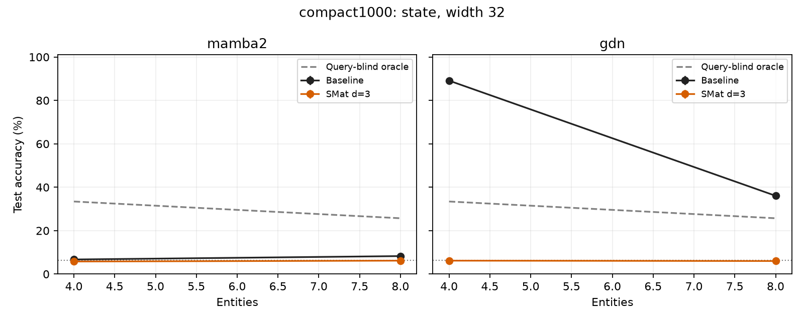
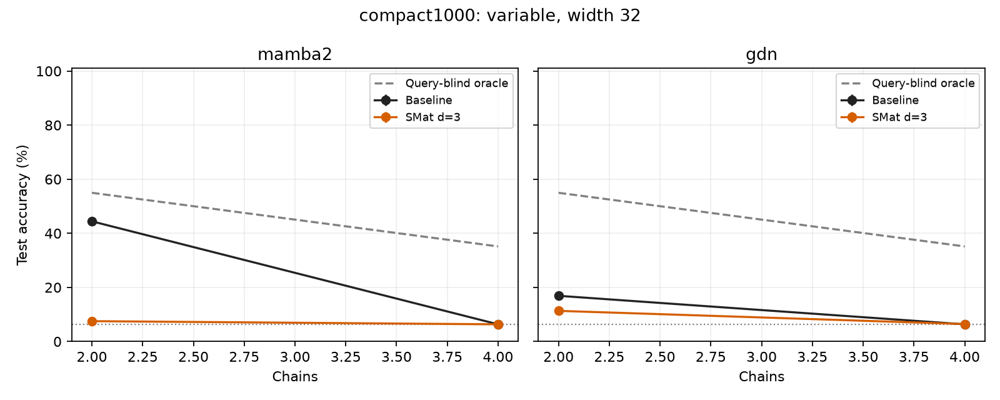
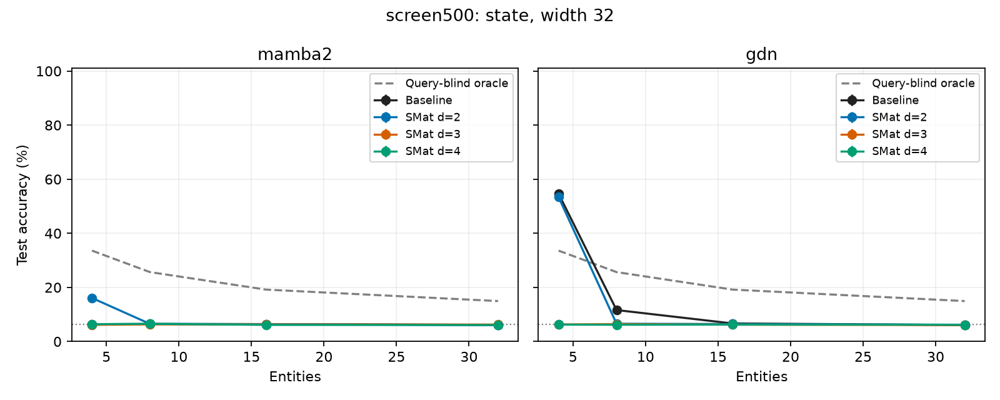
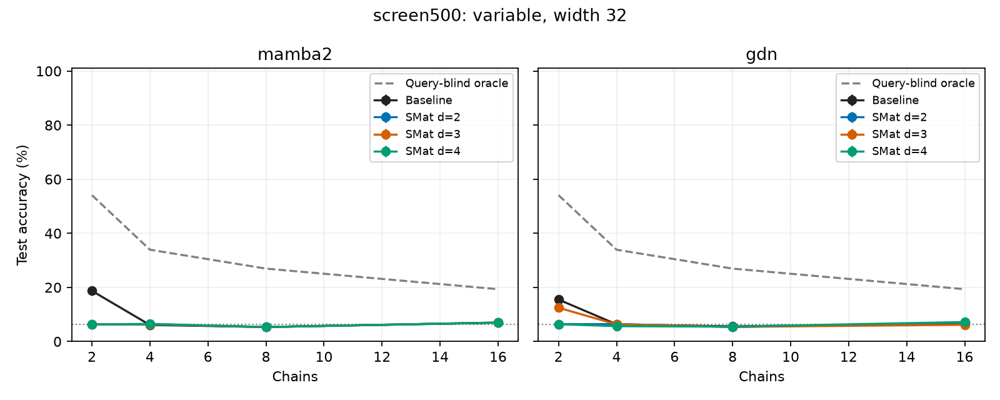
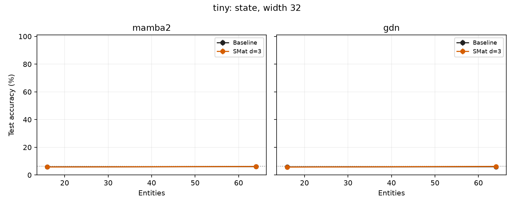
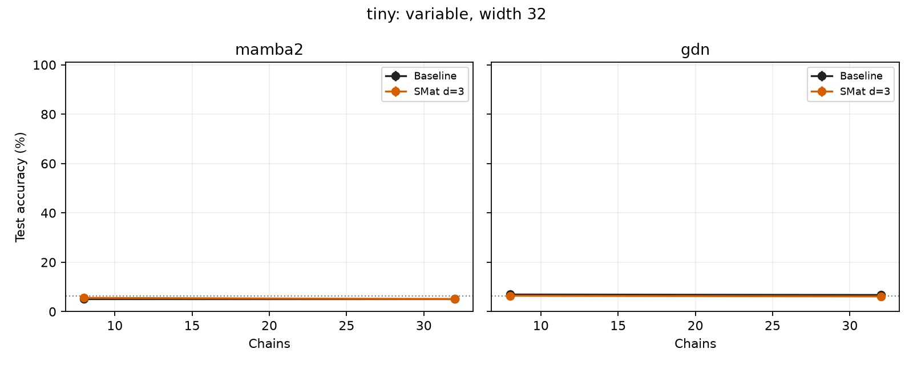
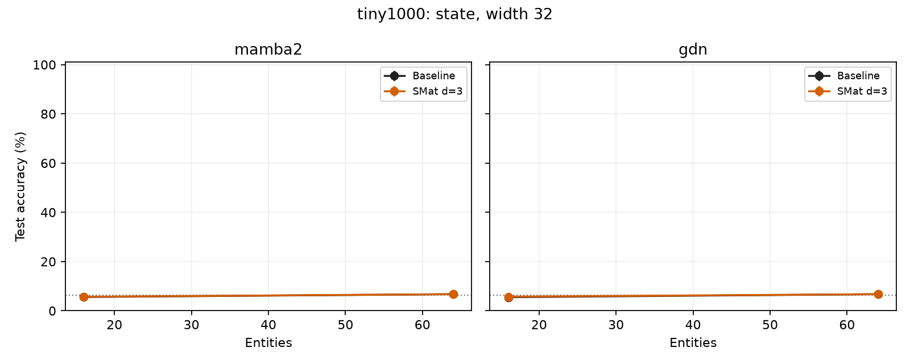
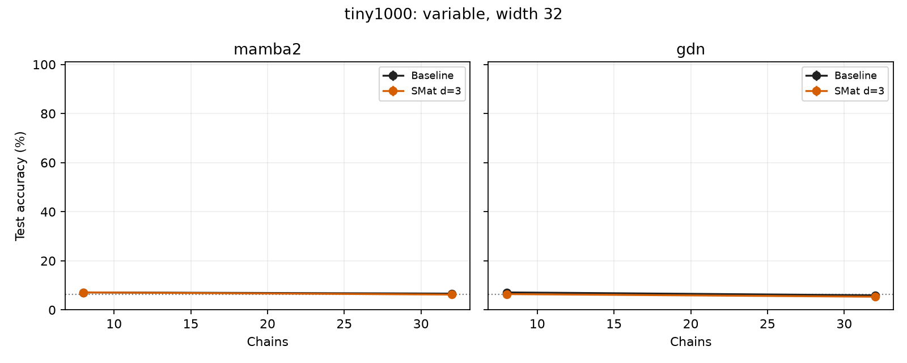

# Synthetic memory experiments

Final-step, independent-test accuracy; chance = 6.25% (16 equiprobable values). Unrestricted vocabulary predictions. Missing cells are pending, not zero. Single-seed results are preliminary. Error bars are sample standard deviations across seeds, not confidence intervals.

## compact1000: state, width 32

| Model | Load | Seeds | Accuracy (%) | Exact set (%) | Parameters |
|---|---:|---:|---:|---:|---:|
| gdn | 4 | 1 | 89.11 | 60.94 | 20,200 |
| gdn | 8 | 1 | 36.06 | 1.56 | 20,200 |
| gdn + SMat d=3 | 4 | 1 | 6.18 | 0.00 | 27,640 |
| gdn + SMat d=3 | 8 | 1 | 6.01 | 0.00 | 27,640 |
| mamba2 | 4 | 1 | 6.71 | 0.00 | 24,856 |
| mamba2 | 8 | 1 | 8.28 | 0.00 | 24,856 |
| mamba2 + SMat d=3 | 4 | 1 | 5.79 | 0.00 | 35,392 |
| mamba2 + SMat d=3 | 8 | 1 | 6.18 | 0.00 | 35,392 |

[Learning curves](compact1000-state-w32-curves.png)

| Load | Query-blind majority (%) | Query-blind last value (%) | Query-blind oracle (%) |
|---:|---:|---:|---:|---:|
| 4 | 21.83 | 29.59 | 33.42 |
| 8 | 15.84 | 18.26 | 25.71 |

## compact1000: variable, width 32

| Model | Load | Seeds | Accuracy (%) | Exact set (%) | Parameters |
|---|---:|---:|---:|---:|---:|
| gdn | 2 | 1 | 16.89 | 16.89 | 28,392 |
| gdn | 4 | 1 | 6.35 | 6.35 | 28,392 |
| gdn + SMat d=3 | 2 | 1 | 11.33 | 11.33 | 35,832 |
| gdn + SMat d=3 | 4 | 1 | 6.45 | 6.45 | 35,832 |
| mamba2 | 2 | 1 | 44.43 | 44.43 | 33,048 |
| mamba2 | 4 | 1 | 6.35 | 6.35 | 33,048 |
| mamba2 + SMat d=3 | 2 | 1 | 7.52 | 7.52 | 43,584 |
| mamba2 + SMat d=3 | 4 | 1 | 6.35 | 6.35 | 43,584 |

[Learning curves](compact1000-variable-w32-curves.png)

| Load | Query-blind majority (%) | Query-blind last value (%) | Query-blind oracle (%) |
|---:|---:|---:|---:|---:|
| 2 | 54.98 | 52.83 | 54.98 |
| 4 | 35.16 | 30.08 | 35.16 |

## screen500: state, width 32

| Model | Load | Seeds | Accuracy (%) | Exact set (%) | Parameters |
|---|---:|---:|---:|---:|---:|
| gdn | 4 | 1 | 54.68 | 6.47 | 20,200 |
| gdn | 8 | 1 | 11.63 | 0.02 | 20,200 |
| gdn | 16 | 1 | 6.67 | 0.00 | 20,200 |
| gdn | 32 | 1 | 6.09 | 0.00 | 20,200 |
| gdn + SMat d=2 | 4 | 1 | 53.39 | 4.03 | 23,700 |
| gdn + SMat d=2 | 8 | 1 | 6.57 | 0.00 | 24,228 |
| gdn + SMat d=2 | 16 | 1 | 6.45 | 0.00 | 24,492 |
| gdn + SMat d=2 | 32 | 1 | 6.16 | 0.00 | 24,492 |
| gdn + SMat d=3 | 4 | 1 | 6.29 | 0.00 | 27,640 |
| gdn + SMat d=3 | 8 | 1 | 6.43 | 0.00 | 27,640 |
| gdn + SMat d=3 | 16 | 1 | 6.22 | 0.00 | 31,328 |
| gdn + SMat d=3 | 32 | 1 | 6.10 | 0.00 | 31,328 |
| gdn + SMat d=4 | 4 | 1 | 6.24 | 0.00 | 29,860 |
| gdn + SMat d=4 | 8 | 1 | 6.20 | 0.00 | 29,860 |
| gdn + SMat d=4 | 16 | 1 | 6.25 | 0.00 | 47,476 |
| gdn + SMat d=4 | 32 | 1 | 6.21 | 0.00 | 47,476 |
| mamba2 | 4 | 1 | 6.39 | 0.00 | 24,856 |
| mamba2 | 8 | 1 | 6.45 | 0.00 | 24,856 |
| mamba2 | 16 | 1 | 6.43 | 0.00 | 24,856 |
| mamba2 | 32 | 1 | 6.13 | 0.00 | 24,856 |
| mamba2 + SMat d=2 | 4 | 1 | 16.10 | 0.00 | 27,512 |
| mamba2 + SMat d=2 | 8 | 1 | 6.52 | 0.00 | 28,568 |
| mamba2 + SMat d=2 | 16 | 1 | 6.40 | 0.00 | 29,096 |
| mamba2 + SMat d=2 | 32 | 1 | 6.09 | 0.00 | 29,096 |
| mamba2 + SMat d=3 | 4 | 1 | 6.16 | 0.00 | 35,392 |
| mamba2 + SMat d=3 | 8 | 1 | 6.33 | 0.00 | 35,392 |
| mamba2 + SMat d=3 | 16 | 1 | 6.30 | 0.00 | 42,768 |
| mamba2 + SMat d=3 | 32 | 1 | 6.26 | 0.00 | 42,768 |
| mamba2 + SMat d=4 | 4 | 1 | 6.40 | 0.00 | 39,832 |
| mamba2 + SMat d=4 | 8 | 1 | 6.55 | 0.00 | 39,832 |
| mamba2 + SMat d=4 | 16 | 1 | 6.14 | 0.00 | 75,064 |
| mamba2 + SMat d=4 | 32 | 1 | 6.09 | 0.00 | 75,064 |

[Learning curves](screen500-state-w32-curves.png)

| Load | Query-blind majority (%) | Query-blind last value (%) | Query-blind oracle (%) |
|---:|---:|---:|---:|---:|
| 4 | 21.50 | 29.67 | 33.61 |
| 8 | 16.67 | 18.07 | 25.66 |
| 16 | 12.99 | 12.23 | 19.19 |
| 32 | 10.94 | 9.23 | 14.95 |

## screen500: variable, width 32

| Model | Load | Seeds | Accuracy (%) | Exact set (%) | Parameters |
|---|---:|---:|---:|---:|---:|
| gdn | 2 | 1 | 15.50 | 15.50 | 28,392 |
| gdn | 4 | 1 | 6.35 | 6.35 | 28,392 |
| gdn | 8 | 1 | 5.59 | 5.59 | 28,392 |
| gdn | 16 | 1 | 6.57 | 6.57 | 28,392 |
| gdn + SMat d=2 | 2 | 1 | 6.40 | 6.40 | 31,892 |
| gdn + SMat d=2 | 4 | 1 | 6.45 | 6.45 | 31,892 |
| gdn + SMat d=2 | 8 | 1 | 5.35 | 5.35 | 32,420 |
| gdn + SMat d=2 | 16 | 1 | 6.96 | 6.96 | 32,684 |
| gdn + SMat d=3 | 2 | 1 | 12.48 | 12.48 | 35,832 |
| gdn + SMat d=3 | 4 | 1 | 6.32 | 6.32 | 35,832 |
| gdn + SMat d=3 | 8 | 1 | 5.40 | 5.40 | 35,832 |
| gdn + SMat d=3 | 16 | 1 | 6.18 | 6.18 | 39,520 |
| gdn + SMat d=4 | 2 | 1 | 6.40 | 6.40 | 38,052 |
| gdn + SMat d=4 | 4 | 1 | 5.66 | 5.66 | 38,052 |
| gdn + SMat d=4 | 8 | 1 | 5.49 | 5.49 | 38,052 |
| gdn + SMat d=4 | 16 | 1 | 7.20 | 7.20 | 55,668 |
| mamba2 | 2 | 1 | 18.73 | 18.73 | 33,048 |
| mamba2 | 4 | 1 | 6.10 | 6.10 | 33,048 |
| mamba2 | 8 | 1 | 5.35 | 5.35 | 33,048 |
| mamba2 | 16 | 1 | 6.98 | 6.98 | 33,048 |
| mamba2 + SMat d=2 | 2 | 1 | 6.37 | 6.37 | 35,704 |
| mamba2 + SMat d=2 | 4 | 1 | 6.27 | 6.27 | 35,704 |
| mamba2 + SMat d=2 | 8 | 1 | 5.35 | 5.35 | 36,760 |
| mamba2 + SMat d=2 | 16 | 1 | 6.96 | 6.96 | 37,288 |
| mamba2 + SMat d=3 | 2 | 1 | 6.37 | 6.37 | 43,584 |
| mamba2 + SMat d=3 | 4 | 1 | 6.37 | 6.37 | 43,584 |
| mamba2 + SMat d=3 | 8 | 1 | 5.35 | 5.35 | 43,584 |
| mamba2 + SMat d=3 | 16 | 1 | 7.01 | 7.01 | 50,960 |
| mamba2 + SMat d=4 | 2 | 1 | 6.30 | 6.30 | 48,024 |
| mamba2 + SMat d=4 | 4 | 1 | 6.52 | 6.52 | 48,024 |
| mamba2 + SMat d=4 | 8 | 1 | 5.35 | 5.35 | 48,024 |
| mamba2 + SMat d=4 | 16 | 1 | 6.98 | 6.98 | 83,256 |

[Learning curves](screen500-variable-w32-curves.png)

| Load | Query-blind majority (%) | Query-blind last value (%) | Query-blind oracle (%) |
|---:|---:|---:|---:|---:|
| 2 | 54.10 | 52.61 | 54.10 |
| 4 | 33.94 | 30.00 | 33.94 |
| 8 | 26.95 | 18.46 | 26.95 |
| 16 | 19.34 | 13.33 | 19.34 |

## tiny: state, width 32

| Model | Load | Seeds | Accuracy (%) | Exact set (%) | Parameters |
|---|---:|---:|---:|---:|---:|
| gdn | 16 | 1 | 5.81 | 0.00 | 20,200 |
| gdn | 64 | 1 | 5.98 | 0.00 | 20,200 |
| gdn + SMat d=3 | 16 | 1 | 5.71 | 0.00 | 31,328 |
| gdn + SMat d=3 | 64 | 1 | 6.20 | 0.00 | 31,328 |
| mamba2 | 16 | 1 | 5.83 | 0.00 | 24,856 |
| mamba2 | 64 | 1 | 6.05 | 0.00 | 24,856 |
| mamba2 + SMat d=3 | 16 | 1 | 5.79 | 0.00 | 42,768 |
| mamba2 + SMat d=3 | 64 | 1 | 6.15 | 0.00 | 42,768 |

[Learning curves](tiny-state-w32-curves.png)

| Load | Query-blind majority (%) | Query-blind last value (%) | Query-blind oracle (%) |
|---:|---:|---:|---:|---:|
| 16 | 12.89 | 12.23 | — |
| 64 | 9.18 | 8.42 | — |

## tiny: variable, width 32

| Model | Load | Seeds | Accuracy (%) | Exact set (%) | Parameters |
|---|---:|---:|---:|---:|---:|
| gdn | 8 | 1 | 6.93 | 6.93 | 28,392 |
| gdn | 32 | 1 | 6.74 | 6.74 | 28,392 |
| gdn + SMat d=3 | 8 | 1 | 6.45 | 6.45 | 39,520 |
| gdn + SMat d=3 | 32 | 1 | 6.15 | 6.15 | 39,520 |
| mamba2 | 8 | 1 | 5.08 | 5.08 | 33,048 |
| mamba2 | 32 | 1 | 5.08 | 5.08 | 33,048 |
| mamba2 + SMat d=3 | 8 | 1 | 5.57 | 5.57 | 50,960 |
| mamba2 + SMat d=3 | 32 | 1 | 5.08 | 5.08 | 50,960 |

[Learning curves](tiny-variable-w32-curves.png)

| Load | Query-blind majority (%) | Query-blind last value (%) | Query-blind oracle (%) |
|---:|---:|---:|---:|---:|
| 8 | 25.59 | 17.87 | — |
| 32 | 15.53 | 9.18 | — |

## tiny1000: state, width 32

| Model | Load | Seeds | Accuracy (%) | Exact set (%) | Parameters |
|---|---:|---:|---:|---:|---:|
| gdn | 16 | 1 | 5.52 | 0.00 | 20,200 |
| gdn | 64 | 1 | 6.74 | 0.00 | 20,200 |
| gdn + SMat d=3 | 16 | 1 | 5.74 | 0.00 | 31,328 |
| gdn + SMat d=3 | 64 | 1 | 6.74 | 0.00 | 31,328 |
| mamba2 | 16 | 1 | 5.59 | 0.00 | 24,856 |
| mamba2 | 64 | 1 | 6.74 | 0.00 | 24,856 |
| mamba2 + SMat d=3 | 16 | 1 | 5.69 | 0.00 | 42,768 |
| mamba2 + SMat d=3 | 64 | 1 | 6.74 | 0.00 | 42,768 |

[Learning curves](tiny1000-state-w32-curves.png)

| Load | Query-blind majority (%) | Query-blind last value (%) | Query-blind oracle (%) |
|---:|---:|---:|---:|---:|
| 16 | 12.89 | 12.23 | — |
| 64 | 9.18 | 8.42 | — |

## tiny1000: variable, width 32

| Model | Load | Seeds | Accuracy (%) | Exact set (%) | Parameters |
|---|---:|---:|---:|---:|---:|
| gdn | 8 | 1 | 7.13 | 7.13 | 28,392 |
| gdn | 32 | 1 | 5.96 | 5.96 | 28,392 |
| gdn + SMat d=3 | 8 | 1 | 6.45 | 6.45 | 39,520 |
| gdn + SMat d=3 | 32 | 1 | 5.37 | 5.37 | 39,520 |
| mamba2 | 8 | 1 | 7.13 | 7.13 | 33,048 |
| mamba2 | 32 | 1 | 6.64 | 6.64 | 33,048 |
| mamba2 + SMat d=3 | 8 | 1 | 7.13 | 7.13 | 50,960 |
| mamba2 + SMat d=3 | 32 | 1 | 6.25 | 6.25 | 50,960 |

[Learning curves](tiny1000-variable-w32-curves.png)

| Load | Query-blind majority (%) | Query-blind last value (%) | Query-blind oracle (%) |
|---:|---:|---:|---:|---:|
| 8 | 25.59 | 17.87 | — |
| 32 | 15.53 | 9.18 | — |

